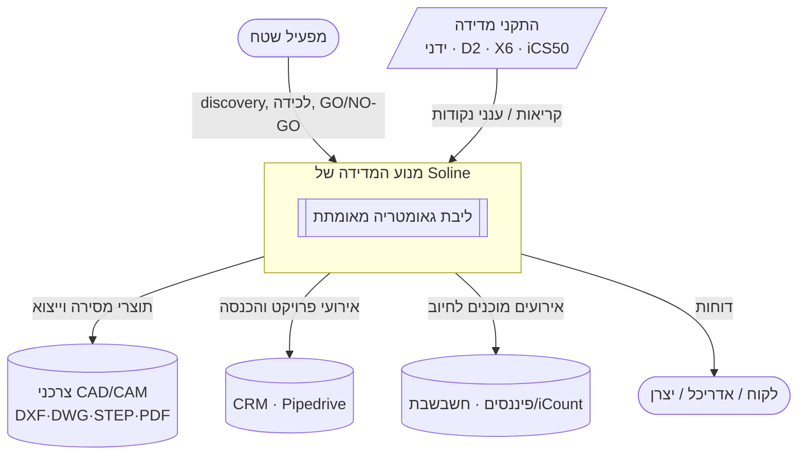
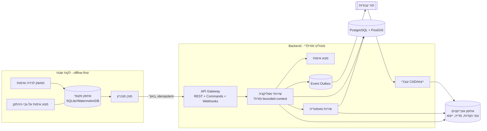
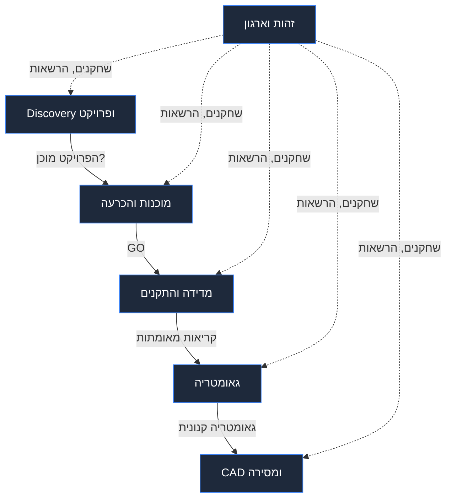

# 01 · סקירת ארכיטקטורה

## 1. מטרה והקשר

מנוע המדידה החכם של Soline הופך **מציאות בשטח** ל**גאומטריה מאומתת ואמינה**
ול**תוצרי CAD מוכנים למסירה**, עם שער GO/NO-GO בר-ביקורת המונע כשלים בשלבי הייצור שבהמשך
הזרם. הוא תוכנן כ**פלטפורמה**: אגנוסטי להתקנים, רב-ורטיקלי ובר-הרחבה.

### עקרונות ליבה (מתוך הבריף) → תרגום ארכיטקטוני

| עיקרון (בריף) | השלכה ארכיטקטונית |
|---|---|
| אין למדוד לפני אימות מוכנות | **שער מוכנות** קודם ל-Precision Mode; נאכף על ידי מכונת מצבים, לא על ידי מוסכמה |
| אימות חובה לכל מדידה קריטית | האימות הוא **Aggregate ממדרגה ראשונה**; "קריטי" הוא תכונה ממודלת עם אינווריאנטה |
| איסוף מידע שעשוי להיות רלוונטי בהמשך | **Discovery מובנה** + הרחבה טיפוסית (JSONB) + מדיניות שימור (לא זריקת נתונים חסרת מבנה) |
| מניעת כשלים במורד הזרם | **שרשרת מקור (provenance) בכל מקום** + אימות צולב + בדיקות כיול; כשלים נתפסים בשער |
| הבנת הפרויקט לפני המדידה | **הקשר ה-Discovery** הוא הקשר תחום (Bounded Context) שהוא תנאי מקדים, במעלה הזרם למדידה |
| Soline היא פלטפורמה, לא אפליקציה למטבחים | **ליבה אגנוסטית לוורטיקל**; מטבחים/אבן/וכו׳ הם קונפיגורציה + תוספים (plugins), לא ענפים בקוד |
| ידע לפני CAD | **המודל הגאומטרי הוא מקור אמת יחיד**; ה-CAD הוא היטל במורד הזרם |
| אגנוסטי להתקנים | **פורטים hexagonal**; ההתקנים הם adapters מאחורי **מודל יכולות** |

## 2. תכונות איכות (ה-NFRs המעצבים את הכול)

מדורגות. כאשר שתיים מתנגשות, הגבוהה מנצחת.

1. **נכונות ועקיבוּת** — מידה שנמסרת חייבת להיות מאומתת באופן שניתן להוכיח, עם שרשרת מקור
   מלאה. זו סיבת הקיום של המוצר.
2. **חוסן offline** — לכידה + אימות + GO/NO-GO מלאים ללא קישוריות *(תלוי ב-Q3)*.
3. **יכולת ביקורת** — כל מעבר מצב וכל מדידה ניתנים לייחוס וחסינים בפני שיבוש.
4. **יכולת הרחבה** — התקן חדש או ורטיקל חדש בלי לגעת בליבה.
5. **עמידות נתונים** — מדידות אינן ניתנות לשחזור; לעולם לא לאבד קריאה (מדידה גולמית).
6. **שמישוּת בשטח** — כפפות, אור שמש, מפעיל יחיד, לחץ זמן (מסלול ה-UX = Gemini).
7. **יכולת התרחבות (Scalability)** — משנה בהמשך; במפורש **אינה** מניע ליום הראשון בעסק המנוהל בידי מייסד.

> שימו לב לסדר: אנו ממטבים למען *לעולם לא לשלוח מספר שגוי*, לא למען תפוקה.

## 3. C4 — הקשר מערכת

## 4. C4 — Containers

נקודה מרכזית: **מנוע האימות רץ בשני מקומות** — על-גבי-ההתקן (כדי ש-GO/NO-GO יעבוד
offline) וב-backend (בדיקה חוזרת סמכותית בעת הסנכרון). אותם חוקים, משותפים כחבילת חוקים
ניידת. ראו [ADR-002](09-ADRs.md) ו-[04-Validation-Engine](04-Validation-Engine.md).

## 5. הקשרי תחום (Bounded Contexts)

שישה הקשרים. כל אחד בעל הנתונים שלו וחושף חוזים; אין טבלאות משתנות משותפות בין
הקשרים (אינטגרציה דרך אירועים/APIs).

| הקשר | בעלות על | השאלה המרכזית שהוא עונה עליה |
|---|---|---|
| **Discovery ופרויקט** | Project, Site, Stakeholder, Plan, RiskAssessment, DiscoveryNote | "לתוך מה אנחנו נכנסים?" |
| **מוכנות והכרעה** | ReadinessCheck, GoNoGoDecision | "האם בטוח למדוד? Go או no-go?" |
| **מדידה והתקנים** | MeasurementSession, Measurement, Reading, Device, Capability, Calibration, CrossValidationSet | "מה מדדנו, במה, ועד כמה אמין?" |
| **גאומטריה** | GeometryModel, Element, Dimension, Constraint | "מהי האמת המאומתת של המרחב?" |
| **CAD ומסירה** | Drawing, Export, Deliverable, Revision | "כיצד מוסרים זאת, בפורמט של הצרכן?" |
| **זהות וארגון** | Organization, Operator, Client, Role | "למי מותר לעשות מה?" |

מיפוי לתת-המערכות שהתבקשו: *מודל הדומיין* = §5 + [מסמך 02]; *הפשטת תוספים/התקנים*
= הקשר המדידה + [מסמך 03]; *מנוע האימות* = מוכנות+מדידה + [מסמך 04]; *צינור ה-CAD* =
גאומטריה+מסירה + [מסמך 05]; *ה-APIs* = [מסמך 06]; *מסד הנתונים* = [מסמך 07];
*backend בר-התרחבות* = [מסמך 08].

## 6. סגנון ארכיטקטוני

- **Hexagonal (ports & adapters)** כך שהתקנים, מייצאי CAD ומערכות חיצוניות הם כולם
  adapters ברי-החלפה סביב ליבת דומיין טהורה.
- **Domain-Driven Design (DDD)** למודל (aggregates אוכפים אינווריאנטות כמו "אין Precision Mode
  ללא GO").
- **מונחה-אירועים בתפרים** (תבנית outbox) כך ש-CRM/פיננסים/אנליטיקה נרשמים ללא
  צימוד.
- **פריסת מונוליט מודולרי** ([ADR-001](09-ADRs.md)) — הקשרים הם מודולים עם גבולות
  נאכפים, יחידת פריסה אחת, מוכנים לפיצול בהמשך.
- **CQRS-lite**: מודלי קריאה כבדים (דשבורדים, ייצוא) הם היטלים (projections); כתיבות עוברות דרך
  aggregates.

## 7. מה אנחנו במפורש **לא** עושים בגרסה 1

- ללא microservices, ללא צי Kubernetes, ללא ריבוי אזורים.
- ללא control plane של SaaS רב-דיירים.
- ללא kernel גאומטרי ל-CAD מבית (עוטפים/קונים — [ADR-004](09-ADRs.md), Q17).
- ללא גאומטריה אוטומטית מבוססת ML/ראייה ממוחשבת (מסלול האלגוריתמים של Gemini עשוי לבנות אב-טיפוס; לא בנתיב הקריטי).
- ללא מימוש לוגיקה עסקית עד לאישור המפרטים.
