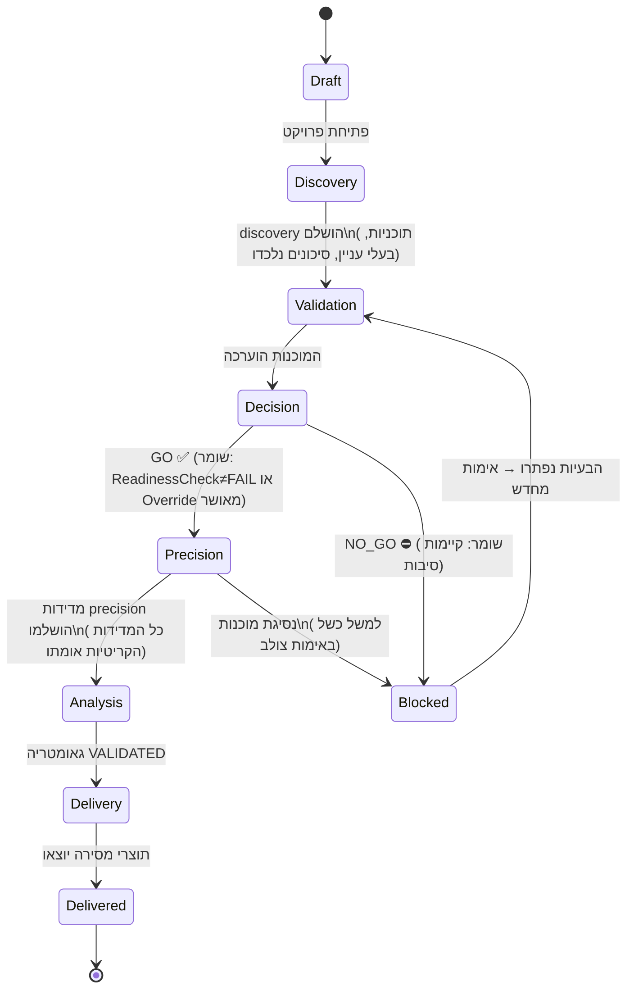
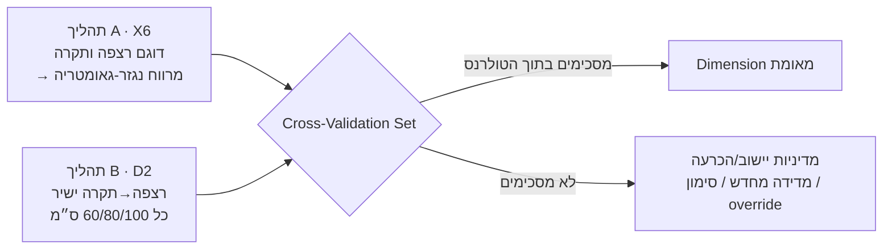

# 02 · מודל הדומיין ותהליך העבודה

> אלה **חוזי תכן** (טיפוסים, אינווריאנטות, אירועים). אין מימוש של שום התנהגות.
> הטיפוסים מוצגים בפסאודו-קוד בסגנון TypeScript אך ורק כדי לדייק לגבי המבנה.

## 1. שפה אחידה (Ubiquitous Language)

| מונח | משמעות (אוצר מילים מוסכם) |
|---|---|
| **Project** | גוף עבודה שהוזמן ב-Site עבור Client. היחידה ברמה העליונה. |
| **Site** | המיקום הפיזי ומערכת הצירים/הדאטום שלו. |
| **Discovery** | הבנה טרום-מדידה: תוכניות, בעלי עניין, סיכונים, אילוצים. |
| **Readiness (מוכנות)** | האם המרחב הפיזי והפרויקט מקיימים את התנאים המקדימים למדידה. |
| **GO / NO-GO** | שער ההכרעה בר-הביקורת המאשר את ה-Precision Mode. |
| **Measurement Session** | ביקור שטח תחום המייצר Measurements. |
| **Measurement** | עובדה כמותית יחידה על המרחב (למשל אורך קיר), אולי בנויה ממספר Readings. |
| **Reading** | נתון גולמי יחיד מהתקן יחיד (immutable, append-only). |
| **Cross-Validation Set** | ‏‏≥2 קריאות/מדידות בלתי-תלויות של אותה עובדה, ממקורות שונים. |
| **Automation Level** | ידני · X6-Assisted · iCS50-Spatial — *כיצד* מיוצרת מדידה. |
| **Geometry Model** | הייצוג הקנוני והמאומת של המרחב. מקור אמת יחיד. |
| **Deliverable** | תוצר הפונה לצרכן (שרטוט, רשימת חיתוך, דוח), מוטל מהגאומטריה. |
| **Critical** | מדידה ששגיאתה גורמת לכשל במורד הזרם ← אימות חובה. |

## 2. Aggregates ואינווריאנטות

**Aggregate** הוא גבול עקביות; האינווריאנטות שלו חייבות להתקיים תמיד.

### 2.1 Project (aggregate root: `Project`)
```
Project {
  id, orgId, clientId, siteId
  vertical: Vertical            // kitchen | stone | aluminum | glass | architecture | construction
  status: ProjectStatus         // see state machine §4
  createdAt, updatedAt
}
Site {
  id, address, coordinateFrame  // origin + axes + unit(mm)  — see Q11
  datumNote
}
```
**אינווריאנטות**
- I-P1: מעברי `status` רק לאורך מכונת המצבים (§4). אין דילוג על השער.
- I-P2: פרויקט לא יכול להגיע ל-`PRECISION` ללא `GoNoGoDecision(GO)` המפנה אליו.

### 2.2 מוכנות והכרעה (aggregate root: `GoNoGoDecision`)
```
ReadinessCheck {
  id, projectId, checklistVersion
  items: ReadinessItem[]        // floor, ceiling, walls, infrastructure, project-readiness…
  result: PASS | FAIL | PARTIAL
}
ReadinessItem { key, required: bool, status: OK|BLOCKED|NA, evidenceRef?, note? }
GoNoGoDecision {
  id, projectId, decision: GO | NO_GO
  basis: ReadinessCheckId
  decidedBy: OperatorId, decidedAt
  reasons: string[]             // mandatory when NO_GO
  overrides?: Override[]        // explicit, attributable exceptions
}
```
**אינווריאנטות**
- I-R1: `GO` מחייב `ReadinessCheck.result != FAIL`, או `Override` מפורש עם סיבה
  ומאשר.
- I-R2: `NO_GO` חייב לשאת ‏≥1 סיבה.
- I-R3: הכרעות הן **immutable**; מצב שהשתנה מייצר הכרעה *חדשה*, תוך שימור
  ההיסטוריה.

### 2.3 Measurement Session (aggregate root: `MeasurementSession`)
```
MeasurementSession { id, projectId, mode: DISCOVERY|VALIDATION|PRECISION, startedBy, startedAt, endedAt? }
Measurement {
  id, sessionId, elementRef?     // links to a geometry element
  quantity: QuantityKind         // LENGTH | HEIGHT | CLEARANCE | ANGLE | AREA | POINT3D
  value: Quantity                // { magnitude:int(mm) , unit: 'mm', frameRef }
  critical: bool
  automationLevel: Manual|X6|iCS50
  readingIds: ReadingId[]        // provenance
  validation: ValidationResultRef?
}
Reading {                        // IMMUTABLE, append-only
  id, deviceId, capability, capturedAt, operatorId
  raw: DevicePayload             // typed per capability
  calibrationId                  // which calibration was in force
  frameRef
}
```
**אינווריאנטות**
- I-M1: ל-`Measurement.critical == true` חייב להיות `validation` שהוא `PASS` לפני שהיא יכולה
  להזין גאומטריה. (אוכף את "אימות חובה לכל מדידה קריטית".)
- I-M2: `Reading` לעולם אינה משתנה או נמחקת (תיקונים הם קריאות חדשות + קישור supersede).
- I-M3: Measurement שנוצרה במצב `PRECISION` מחייבת שהפרויקט יהיה במצב `PRECISION`
  (אין מדידה לפני GO).
- I-M4: כל Reading מפנה ל-`Calibration` תקף ובתוך החלון עבור ההתקן שלה (או מסומן
  `uncalibrated`).

### 2.4 Cross-Validation Set (value object בתוך הקשר המדידה)
```
CrossValidationSet {
  factRef                        // the thing being validated (e.g. floor-to-ceiling at grid X)
  members: MeasurementRef[]      // ≥2 from independent sources
  agreement: { delta:int(mm), withinTolerance: bool, toleranceApplied }
  outcome: AGREE | DISAGREE
  reconciliation?: Reconciliation
}
```
כאן ה*"X6 ו-D2 הם מערכי נתונים לאימות צולב, אף אחד אינו מחליף את
השני"* של הבריף הופך לאובייקט ממודל. ראו [04-Validation-Engine](04-Validation-Engine.md).

### 2.5 גאומטריה (aggregate root: `GeometryModel`)
```
GeometryModel { id, projectId, revision, frameRef, status: DRAFT|VALIDATED|LOCKED }
Element {
  id, kind: WALL|FLOOR|CEILING|OPENING|OBSTACLE|CUSTOM
  dimensions: Dimension[]
  createdBy: MANUAL | X6         // creation method (brief: geometry via manual or X6)
}
Dimension {
  id, quantity, value, provenance: MeasurementRef,   // must trace to a validated Measurement
  validation: PASS|PENDING|FAIL
}
Constraint { kind: PARALLEL|PERPENDICULAR|EQUAL|SUM|DIAGONAL, refs[] }  // plausibility checks
```
**אינווריאנטות**
- I-G1: `Dimension` ללא `provenance` אינו יכול להתקיים (אין מספרים חסרי מקור).
- I-G2: `GeometryModel.status = VALIDATED` מחייב שאימות **כל** Dimension = PASS.
  (בריף: *"ללא קשר לשיטת היצירה, המידות חייבות להיות מאומתות בלייזר או בסרט מדידה."*)
- I-G3: גאומטריה `LOCKED` היא immutable; שינויים מפצלים `revision` חדש.

### 2.6 מסירה (aggregate root: `Deliverable`)
```
Deliverable { id, projectId, geometryRevision, kind, exports: Export[], status }
Export { format: DXF|DWG|STEP|PDF|CSV|VENDOR, uri, generatedAt, checksum }
```
**אינווריאנטות**
- I-D1: Deliverable יכול להיווצר רק מ-`GeometryModel` שהוא `VALIDATED` (או `LOCKED`).
- I-D2: כל Export רושם את ה-`geometryRevision` המדויק ו-checksum (עקיבוּת).

## 3. אירועי דומיין (תפרי אינטגרציה)

נפלטים דרך ה-outbox; נצרכים על ידי הקשרים אחרים, הדשבורד, CRM, פיננסים, אנליטיקה.

| אירוע | נפלט כאשר | צרכנים בולטים |
|---|---|---|
| `ProjectCreated` | פרויקט חדש | CRM, דשבורד |
| `DiscoveryCompleted` | ה-discovery הושלם | מוכנות |
| `ReadinessEvaluated` | ה-checklist הורץ | ממשק ההכרעה |
| `GoNoGoDecided{decision}` | השער הוכרע | מדידה, CRM, דשבורד, ביקורת |
| `MeasurementRecorded` | המדידה נשמרה | גאומטריה, אנליטיקה |
| `CrossValidationFailed` | אי-הסכמה > טולרנס | התראת מפעיל, ביקורת |
| `GeometryValidated` | המודל אומת במלואו | מסירה |
| `DeliverableExported{format}` | הופק ייצוא | CRM (העבודה הושלמה), פיננסים (בר-חיוב), לקוח |
| `MeasurementSuperseded` | הונפק תיקון | ביקורת |

אירועים הם **עובדות בזמן עבר**, immutable, מגורסאות (`schemaVersion`).

## 4. מכונת מצבים של תהליך העבודה (לב המוצר)

תהליך העבודה של הבריף — *Discovery ← אימות ← GO/NO-GO ← Precision ← אנליזה ← מסירה* —
ממודל כמכונת `Project.status`. למעברים יש **שומרים (guards)** (תנאים מקדימים).



**סיכום שומרים**

| מעבר | שומר (חייב להתקיים) |
|---|---|
| Discovery→Validation | שדות discovery נדרשים קיימים; ‏≥1 תוכנית או דגל מפורש "אין-תוכניות" |
| Validation→Decision | ReadinessCheck הורץ מול גרסת ה-checklist הנוכחית |
| Decision→**Precision** | `GoNoGoDecision.decision == GO` (I-P2) |
| Decision→Blocked | `decision == NO_GO` עם סיבות (I-R2) |
| Precision→Analysis | אין Measurement `critical` עם אימות ≠ PASS (I-M1) |
| Analysis→Delivery | `GeometryModel.status == VALIDATED` (I-G2) |

**מדוע מכונת מצבים ולא דגלים/בוליאנים:** היא הופכת את "אין מדידה לפני GO" לבלתי-אפשרי
מבנית ולא להערת code review, וכל מעבר הוא אירוע בר-ביקורת.

## 5. רמות אוטומציה והתהליך הכפול של מדידה אנכית

`automationLevel` הוא **תכונת אסטרטגיה** על Measurement, לא עץ תת-מחלקות:

- **ידני** — מפעיל + סרט מדידה/מכשיר יד; Reading יחידה ואמינה.
- **X6-Assisted** — X6 דוגם נקודות/גאומטריה; מספר Readings ← Measurement נגזרת.
- **iCS50-Spatial** — לכידה צפופה; ענן נקודות באחסון אובייקטים, Measurements מחולצות.

זרימת ה**מרווח האנכי (vertical clearance)** של הבריף היא שני יצרנים מקבילים המזינים
`CrossValidationSet` יחיד:



אף תהליך אינו סמכותי לבדו (ממדל את I-M1 + CrossValidationSet). מדיניות היישוב
היא **חוק**, בת-קונפיגורציה לכל ורטיקל — מוגדרת ב-[מסמך 04](04-Validation-Engine.md).
