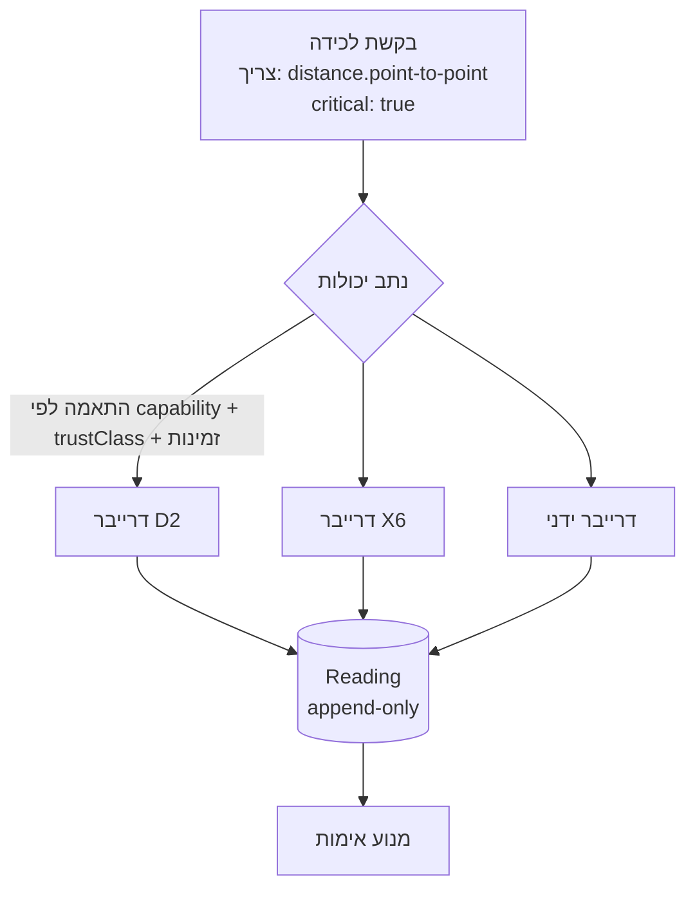
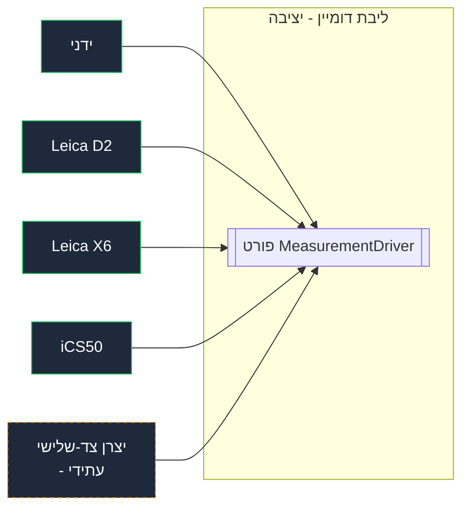

# 03 · ארכיטקטורת התקנים ותוספים

> חוזי תכן בלבד. הממשקים שלהלן הם **פורטים**; דרייברים קונקרטיים הם adapters
> שייבנו לאחר אישור ולאחר מחקר ה-SDK של ההתקנים (Q4/Q5, מסלול Gemini).

## 1. הבעיה עם "אגנוסטי להתקנים"

ממשק שטוח `Device.measure(): number` נכשל מיד: סרט מדידה, לייזר BLE
(D2), disto תלת-ממדי (X6) וסורק מרחבי (iCS50) אינם חולקים פרימיטיב משותף. גם קלט ידני
הוא "התקן" (האדם). לפיכך אנו ממדלים **יכולות**, לא התקנים.

## 2. מודל היכולות

התקן **מפרסם יכולות**; מדידה **מבקשת** יכולת; נתב מתאים
ביניהן. הוספת התקן חדש = רישום דרייבר המפרסם יכולות. הליבה לעולם אינה
משתנה.

```
type Capability =
  | 'distance.point-to-point'     // D2, X6, manual
  | 'point.3d'                    // X6, iCS50
  | 'angle'                       // X6
  | 'area.derived'                // X6
  | 'scan.pointcloud'             // iCS50
  | 'level.inclination'           // X6 (if supported)
  | 'manual.entry';               // human

interface DeviceDescriptor {
  id: DeviceId;
  vendor: string; model: string;         // e.g. Leica / D2
  transport: 'ble' | 'usb' | 'wifi' | 'file-import' | 'manual';
  capabilities: CapabilityProfile[];      // see §3
  calibration: CalibrationState;          // Q12
  firmware?: string;
}
```

## 3. פרופיל יכולת (מצהיר *עד כמה טוב* ו*כיצד בשימוש*)

שני התקנים עשויים שניהם להציע `distance.point-to-point` אך בדיוק ובאינטראקציה
שונים. הפרופיל לוכד זאת כדי שמנוע האימות יוכל להסיק לגבי מידת האמון.

```
interface CapabilityProfile {
  capability: Capability;
  accuracy: { absoluteMm: number; relativePct?: number };  // e.g. D2 ±1.5mm
  range?: { minMm: number; maxMm: number };
  acquisition: 'one-shot' | 'stream' | 'batch-file';
  trustClass: 1|2|3|4|5;   // used by validation weighting (5 = highest)
  outputSchema: JsonSchemaRef; // typed payload for this capability
}
```

## 4. פורטים (גבול hexagonal)

הדומיין מדבר רק עם הפורטים הללו; הוא לעולם אינו מייבא SDK של יצרן.

```
// Inbound: acquire a reading for a requested capability
interface MeasurementDriver {
  descriptor(): DeviceDescriptor;
  connect(): Promise<DriverSession>;
  supports(cap: Capability): boolean;
}
interface DriverSession {
  capture(request: CaptureRequest): Promise<Reading>;   // one-shot / stream chunk
  stream?(request: CaptureRequest): AsyncIterable<Reading>;
  importFile?(ref: BlobRef): Promise<Reading[]>;         // iCS50 point-cloud import
  close(): Promise<void>;
}
// Outbound: how a driver hands raw data back
type Reading = {
  deviceId; capability; capturedAt; operatorId;
  raw: unknown;               // validated against CapabilityProfile.outputSchema
  calibrationId; frameRef;
};
```

קלט ידני מממש את **אותו** פורט `MeasurementDriver` (transport: `manual`,
capability: `manual.entry`) כך שהצינור אחיד — אדם הוא פשוט עוד adapter.

## 5. רישום דרייברים וניתוב



- הנתב בוחר דרייבר לפי **היכולת הנדרשת**, ואז לפי **trustClass**, זמינות
  ותוקף כיול.
- עבור **אימות צולב**, הנתב בוחר במכוון **שני מקורות בלתי-תלויים** (למשל
  X6 + D2) ומתייג את הקריאות המתקבלות ל-`CrossValidationSet`.
- מדיניות הבחירה בת-קונפיגורציה לכל ורטיקל (אבן עשויה לדרוש trustClass ≥ 4 על מדידות קריטיות).

## 6. כיול ובריאות (Q12)

```
CalibrationState { calibratedAt, validUntil, certificateRef?, status: VALID|EXPIRING|EXPIRED }
```
- דרייבר המדווח כיול `EXPIRED` ← הקריאות מסומנות `uncalibrated`; מנוע האימות
  דוחה אותן עבור מדידות `critical` אלא אם בוצע override (בר-ייחוס).
- בריאות ההתקן (סוללה, אות BLE, טמפרטורה אם נחשפת) מוצגת לממשק השטח כך
  שמפעיל לא נותר תקוע באמצע session.

## 7. יכולת הרחבה: ה-SDK לתוספים (תפר הפלטפורמה — לתכנן, לדחות את הבנייה)

כדי לכבד את "פלטפורמה, לא אפליקציה למטבחים" בלי לבנות יתר על המידה כעת:

- להגדיר את הפורט `MeasurementDriver` + סכמת `CapabilityProfile` כ**חוזה מפורסם**
  (חבילה מגורסאת). הדרייברים הפנימיים (ידני, D2, X6, iCS50) הם הצרכנים הראשונים.
- יצרן צד-שלישי עתידי מממש את אותו פורט ← ההתקן שלהם "פשוט עובד". **אנו מתכננים
  את התפר עכשיו, איננו בונים SDK/מרקטפלייס ציבורי בגרסה 1** (Q1).
- הדרייברים מתגלים דרך מניפסט רישום; אין צורך בקומפילציה מחדש של הליבה כדי להוסיף אחד.



## 8. שיקולי offline עבור התקנים

- צימוד BLE ולכידה מתרחשים **על לקוח השטח**; הקריאות נשמרות מקומית תחילה
  (עמידות > קישוריות).
- ענני נקודות (iCS50) עשויים להיות גדולים; על-גבי-ההתקן אנו שומרים **הפניה + תצוגה מקדימה מוקטנת**, ודוחים
  העלאה מלאה לסנכרון כשיש רשת. רישום/עיבוד ענן מלא הוא עבודת worker ב-backend.
- קוד דרייבר שחייב לרוץ על-גבי-ההתקן נכתב מול אותו פורט, מקומפל עבור סביבת
  הריצה של הלקוח — ההפשטה היא מה שמאפשר הרצה כפולה על-גבי-ההתקן/ב-backend.

## 9. פריטים פתוחים המזינים תכן זה
- **Q4/Q5**: ה-SDK/הטלמטריה המדויקים לכל התקן קובעים אילו מצבי `transport` ו-`acquisition`
  הם ממשיים. החוזים שלעיל רחבים במכוון כדי לספוג את תוצאת המחקר.
- האם עיבוד ענן הנקודות של iCS50 הוא **בגרסה 1 או מאוחר יותר** הוא הכרעת scope (זו תת-המערכת
  הבודדת הכבדה ביותר).
