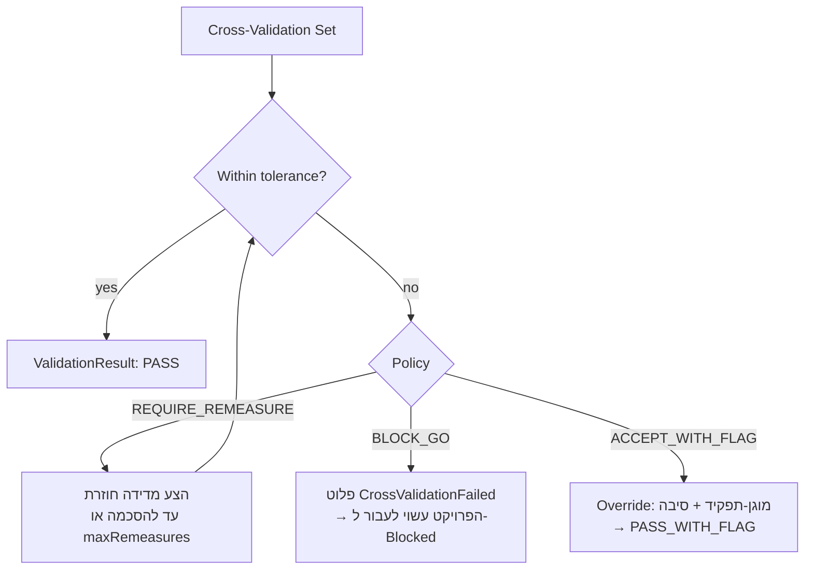
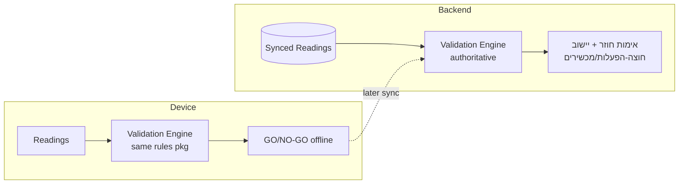

# 04 · מנוע האימות

> מנוע האימות הוא עמוד השדרה של המוצר — הוא מקודד את *"האימות הוא חובה"* ואת
> *"מנע כשלים במורד הזרם."* הוא בנוי בגישת **חוקים-כנתונים**: מעריך גנרי + מערכת חוקים
> ייעודית לכל אנכי (vertical). זהו מסמך תכן בלבד; תוכן החוקים ממתין ל-Q6/Q7.

## 1. תחומי אחריות

1. להכריע האם **Measurement** (מדידה) הוא אמין (בדיקות מקור-יחיד).
2. להכריע האם **Cross-Validation Set** (קבוצת אימות צולב) מסכימה עם עצמה (יישוב רב-מקורי).
3. להזין את הערכת ה**מוכנות** ואת **שער GO/NO-GO**.
4. להפיק **ValidationResult בר-ביקורת** עם החוקים והקלטים המדויקים שנעשה בהם שימוש.
5. לרוץ **באופן זהה על-גבי-המכשיר (on-device) ובצד השרת (backend)** — שער GO/NO-GO במצב offline, ובדיקה חוזרת סמכותית בעת הסנכרון.

## 2. טקסונומיית החוקים

| מחלקת חוק | שאלה | דוגמה |
|---|---|---|
| **נוכחות (Presence)** | האם כל עובדה נדרשת/קריטית נלכדה? | כל 4 הקירות + אלכסון נמדדו |
| **יתירות (Redundancy)** | האם לעובדה קריטית יש ≥2 מקורות בלתי-תלויים? | למרווח (clearance) יש X6 *וגם* D2 |
| **טולרנס (Tolerance)** | האם מקורות בלתי-תלויים מסכימים בתוך הגבולות? | \|X6−D2\| ≤ tol(vertical, quantity) |
| **סבירוּת (Plausibility)** | האם הגאומטריה שפויה פנימית? | קירות נגדיים שווים; אלכסונים עקביים; סכום-החלקים = השלם |
| **כיול (Calibration)** | האם כל מקור היה בתוקף-כיול? | אין מכשיר EXPIRED על עובדה קריטית |
| **סביבתי (Environmental)** | האם התנאים היו תקפים? | טמפרטורה/טווח-יעד בתוך מפרט המכשיר (אם ידוע) |
| **שלמות (Completeness)** | האם רשימת-התיוג של המוכנות מסופקת? | רצפה/תקרה/קירות/תשתית — הכול תקין |

כל חוק הוא **נתון**:
```
Rule {
  id, class, appliesTo: { quantity?, vertical?, critical? },
  params: {...},                  // e.g. tolerance thresholds
  severity: BLOCKER | WARNING | INFO,
  message: TemplateRef
}
RuleSet { vertical, version, rules: Rule[] }   // versioned, per vertical
```

## 3. מודל הטולרנס (Q6)

הטולרנס **אינו קבוע**. הוא נפתר לפי (vertical → quantity → קריטיוּת → חומר):

```
Tolerance {
  absoluteMm: number;            // e.g. 2mm
  relativePct?: number;          // e.g. 0.1%
  combine: 'max' | 'min' | 'sum' // how absolute & relative combine
}
resolve(vertical, quantity, critical, material?) -> Tolerance
```
מבחן ההסכמה עבור זוג אימות-צולב:
```
delta = |a.value - b.value|
limit = combine(absoluteMm, relativePct% * nominal)
withinTolerance = delta <= limit
```
> ⛔ המספרים בפועל הם **החלטה תחומית (domain decision)** (אבן ≠ בנייה). המנוע נשלח ריק
> ומאוכלס לכל vertical לאחר אישור. ההחצנה הזו מכוונת (Q6/Q7).

## 4. מדיניות היישוב (Q7) — מה קורה בעת אי-הסכמה

ניתנת להגדרה לכל vertical/חומרה. המדיניות עצמה היא נתון:

```
ReconciliationPolicy {
  onDisagree: 'REQUIRE_REMEASURE' | 'BLOCK_GO' | 'ACCEPT_WITH_FLAG';
  maxRemeasures: number;
  overrideAllowedBy: Role[];      // who may accept-with-flag
  requireReasonOnOverride: true;
}
```



כל תוצאה נרשמת עם הקלטים, גרסאות החוקים, ו(במקרה של Override) מי/מדוע — כדי לספק
בר-ביקוריות.

## 5. ValidationResult (התוצר בר-הביקורת)

```
ValidationResult {
  id, subjectRef,                 // Measurement | CrossValidationSet | ReadinessCheck | GeometryModel
  outcome: PASS | PASS_WITH_FLAG | FAIL | PENDING,
  ruleSetVersion,                 // exactly which rules ran
  evaluations: RuleEvaluation[],  // per-rule input+result — full transparency
  overrides?: Override[],
  evaluatedBy: 'on-device'|'backend', evaluatedAt,
  inputsHash                      // tamper-evidence over the inputs
}
RuleEvaluation { ruleId, class, severity, passed: bool, observed, threshold, note }
```

## 6. שער GO / NO-GO

השער הוא **צבירה של שלמות + מוכנות (Completeness + Readiness)**, ולא רעיון חדש:

```
evaluateGate(project) =>
  readiness = evaluate(ReadinessCheck, ruleSet.completeness)
  GO   if readiness.result != FAIL  (or authorised Override)
  NO_GO otherwise, with reasons = failing BLOCKER evaluations
```
הפלט הוא ה-Aggregate בשם `GoNoGoDecision` ([מסמך 02](02-Domain-Model-and-Workflow.md) §2.2),
בלתי-משתנה ופולט אירועים (`GoNoGoDecided`).

## 7. On-device מול backend (הרצה כפולה)


- מערכת החוקים היא **חבילה ניתנת-לגרסה ונשואה (portable)** הנשלחת לשתי סביבות הריצה; מכשיר רושם
  את `ruleSetVersion` שבו השתמש.
- האימות החוזר בצד השרת הוא סמכותי ויכול ללכוד בעיות חוצות-**הפעלה (session)** שמכשיר בודד
  לא יכול לראות. פערים בין תוצאות on-device לתוצאות backend נרשמים אף הם.

## 8. מטרות-שאינן / אזהרות
- המנוע הוא **דטרמיניסטי ובר-הסבר** — אין ניקוד קופסה-שחורה בנתיב הקריטי.
  (האלגוריתמים של Gemini רשאים *להציע*, אך השער מונע-חוקים ובר-ביקורת.)
- החוקים **אינם** מקודדים-קשיח לכל vertical בליבת התחום; vertical חדש הוא `RuleSet` חדש,
  לא ענף קוד — זה מה שמשמר את Soline כפלטפורמה.
