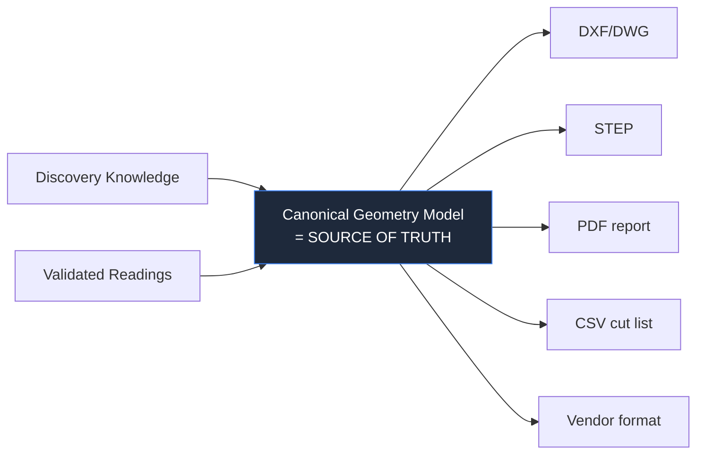
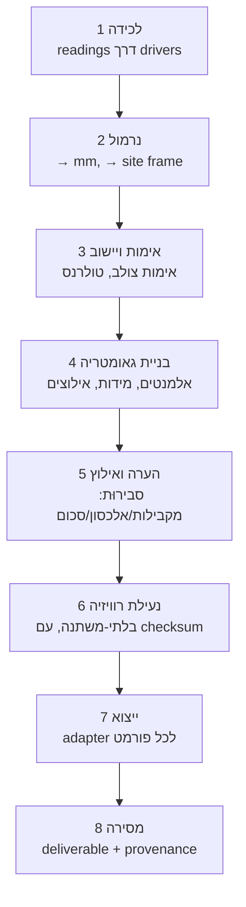

# 05 · צינור ה-CAD

> עיקרון מן התדריך: **"ידע לפני CAD."** לפיכך ה-CAD הוא **היטל (projection)** של המודל
> הגאומטרי המאומת — לעולם לא מקור האמת. מסמך תכן בלבד.

## 1. כיוון האמת



קובצי CAD הם **פלטים**. אם ה-CAD של לקוח סותר את המודל הגאומטרי שלנו, המודל הגאומטרי
מנצח (והפער הוא ממצא אימות). לעולם איננו מבצעים round-trip *מתוך* DXF אל תוך האמת.

## 2. שלבי הצינור



| שלב | קלט | פלט | הערות |
|---|---|---|---|
| 1 לכידה | קריאות מכשיר | `Reading[]` | הוספה-בלבד; מצורפת שרשרת מקור (provenance) |
| 2 נרמול | קריאות גולמיות | כמויות קנוניות (מ״מ, מסגרת אתר) | **יחידה יחידה + מסגרת יחידה** (Q11) מסלקת את מחלקת השגיאות מספר 1 |
| 3 אימות | מדידות | `ValidationResult` | שער להמשך; כשלים חוזרים בלולאה אחורה |
| 4 בנייה | מדידות מאומתות | `GeometryModel(DRAFT)` | אלמנטים + מידות, לכל אחד שרשרת מקור (I-G1) |
| 5 הערה | גאומטריה | גאומטריה מאולצת | אילוצי סבירוּת מוסיפים בדיקות יתירות |
| 6 נעילה | גאומטריה מאומתת | `GeometryModel(LOCKED, revision)` | בלתי-משתנה; שינויים חדשים מפצלים רוויזיה (I-G3) |
| 7 ייצוא | גאומטריה נעולה | קובצי פורמט | **מתאמי ייצוא**, אחד לכל פורמט |
| 8 מסירה | ייצואים | `Deliverable` | רושם geometryRevision + checksum (I-D2) |

## 3. המודל הגאומטרי הקנוני (ייצוג פנימי)

בלתי-תלוי בכל פורמט CAD. מינימלי, מדויק, ואגנוסטי לגרעין (kernel) של CAD:

```
GeometryModel { id, projectId, revision, frameRef, status }
Element { id, kind, sketch: Path2D|Mesh3D, dimensions[], constraints[], createdBy }
Dimension { quantity, value(mm), provenance→Measurement, validation }
Constraint { kind: PARALLEL|PERP|EQUAL|SUM|DIAGONAL, refs[] }
```
- דו-ממד-תחילה (קירות/פתחים/משטחים הם ברובם מישוריים) עם תלת-ממד היכן ש-verticals נדרשים לכך
  (מרווח clearance, תקרות). ענני נקודות (iCS50) *מופנים אליהם (referenced)*, לא מוטמעים.
- המודל **ניתן לבנייה ידנית או מ-X6** (תדריך), אך הייצוג זהה —
  `createdBy` הוא מטא-נתון, לא טיפוס שונה.

## 4. מתאמי ייצוא (ports & adapters שוב)

```
interface ExportAdapter {
  format: 'DXF'|'DWG'|'STEP'|'PDF'|'CSV'|'VENDOR';
  export(model: GeometryModel, opts): Promise<ExportArtifact>;  // artifact → object storage
}
```
- מתאם אחד לכל פורמט צרכן (Q14 מגדיר את הרשימה האמיתית).
- המתאמים הם **היטלים טהורים**: דטרמיניסטיים, אידמפוטנטיים, ללא שינוי (mutation) של המודל.
- ייצואים כבדים רצים כ**עובדי רקע (async workers)** (תור) — נתיב השטח/ה-API נותר קשוב.

## 5. לבנות או לקנות את גרעין ה-CAD (Q17)

**המלצה: לקנות/לעטוף.** גרעין גאומטרי ברמת ייצור + כותבי DXF/DWG/STEP הם הנדסה של שנים.
אנו מחזיקים ב**מודל הגאומטרי המאומת** (הקניין הרוחני והחפיר שלנו) ומתייחסים לייצור CAD
כאל מתאם מעל ספרייה מורשית/OSS. זה משמר את הנתיב הקריטי (אמת מאומתת) לחלוטין בבעלותנו
בלי להמציא את ה-CAD מחדש.

- גישה מועמדת: ספריות ייצוא CAD מסחריות/OSS מאחורי `ExportAdapter`; להעריך במסלול
  "מחקר SDK/API" של Gemini.
- מפורשות **תפר (seam)**: אם נבנה גרעין בהמשך, רק המתאמים משתנים.

## 6. ניהול רוויזיות ושלמות מסירה

- כל שינוי גאומטרי לאחר `LOCKED` יוצר **רוויזיה חדשה**; תוצרי המסירה מקבעים רוויזיה.
- כל `Export` נושא **checksum** ואת `geometryRevision` המקורי → יצרן יכול
  להוכיח מאיזו אמת נגזר החלק שלו (הגנה מפני אחריות, Q13).
- תוצרי מסירה שהוחלפו נשמרים (ביקורת), ומסומנים `superseded-by`.

## 7. מה אנו דוחים

- עריכת CAD שיתופית בזמן-אמת.
- הסקת גאומטריה אוטומטית מענני נקודות/ראייה ממוחשבת (מסלול אב-טיפוס של Gemini; לא בנתיב
  הקריטי).
- מידול פרמטרי/מבוסס-מאפיינים — גרסה 1 זקוקה ל*שרטוטים ממודדים ומדויקים*, לא לאפליקציית CAD מלאה.
