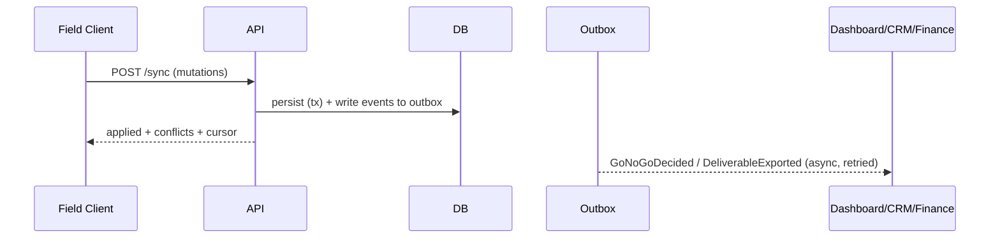

# 06 · תכן ה-API

> צורות החוזה (contract) לסקירה. לא מומשו handlers. סגנון: REST מכוון-משאב עבור
> קריאות/CRUD, נקודות-קצה מפורשות של **פקודות (commands)** למעברי מצב, **events/webhooks**
> לאינטגרציה, וממשק **sync** ייעודי עבור offline-first (Q3).

## 1. עקרונות

- **מתוחם-ארגון ומאומת** — כל בקשה נושאת org + פועל (actor); הרשאה לפי תפקיד.
- **כתיבות אידמפוטנטיות** — כל קריאה משנה (mutating) מקבלת `Idempotency-Key` (קריטי ל-sync/retry).
- **פקודות למעברים** — שינויי מצב הם פקודות בעלות שם, ולא PATCH של שדה `status`,
  כך שמכונת-המצבים ([מסמך 02] §4) נותרת סמכותית ובת-ביקורת.
- **בעל-גרסה** — `/{v1}` בנתיב; אירועים נושאים `schemaVersion`.
- **אין כתיבות ללא-מקור** — Dimension/Measurement ללא שרשרת מקור (provenance) נדחה (משקף
  את אינוריאנטי התחום (domain invariants) I-G1/I-M1).

## 2. מפת המשאבים

```
/v1/orgs/{orgId}
  /projects
    POST                      create project
    GET                       list/filter
  /projects/{id}
    GET                       project + status
    /discovery                GET/PUT structured discovery; POST notes/media
    /readiness                GET latest; POST evaluate → ReadinessCheck
    /decisions                GET history; POST decide (GO/NO_GO)         [command]
    /sessions                 GET; POST start session
    /geometry                 GET current model/revisions
    /deliverables             GET; POST generate                          [command]
  /sessions/{id}
    /measurements             GET; POST record measurement
    :end                      POST end session                            [command]
  /measurements/{id}          GET; POST supersede                         [command]
  /devices                    GET registry; POST register; GET {id}/health
  /exports/{id}               GET status + signed download URL
  /events                     GET (server-sent/stream) ; webhooks config
```

## 3. נקודות-קצה של פקודות (מעברי מצב)

כל אחת ממופה למעבר שמור (guarded); מחזירה את ה-Aggregate המתקבל + האירוע הנפלט.

| פקודה | שומר (Guard, נאכף-שרת) | פולט |
|---|---|---|
| `POST /projects/{id}/discovery:complete` | שדות discovery נדרשים קיימים | `DiscoveryCompleted` |
| `POST /projects/{id}/readiness` | סופקה גרסת רשימת-תיוג | `ReadinessEvaluated` |
| `POST /projects/{id}/decisions` `{decision, reasons?, override?}` | GO⇒readiness≠FAIL או override; NO_GO⇒reasons | `GoNoGoDecided` |
| `POST /sessions` `{mode}` | מצב PRECISION ⇒ הפרויקט ב-`Precision` | `SessionStarted` |
| `POST /sessions/{id}/measurements` | mode/critical/provenance תקפים | `MeasurementRecorded` |
| `POST /projects/{id}/deliverables` | geometry `VALIDATED` | `DeliverableExported*` |

`*` אסינכרוני — מחזיר `202 Accepted` + ידית (handle) של עבודת הייצוא; ההשלמה דרך event/webhook.

## 4. חוזים לדוגמה (צורות request/response)

**רישום מדידה**
```
POST /v1/orgs/{org}/sessions/{sid}/measurements
Idempotency-Key: <uuid>
{
  "quantity": "CLEARANCE",
  "critical": true,
  "automationLevel": "X6",
  "value": { "magnitude": 2743, "unit": "mm", "frameRef": "site-frame-1" },
  "readingIds": ["r_a1", "r_b7"],          // provenance required for critical
  "elementRef": "el_ceiling_3"
}
→ 201 { "id":"m_88", "validation": { "outcome":"PENDING" }, "event":"MeasurementRecorded" }
```

**הכרעת השער**
```
POST /v1/orgs/{org}/projects/{id}/decisions
{ "decision":"NO_GO", "reasons":["ceiling not accessible at grid C","floor not level > tol"] }
→ 201 { "id":"d_12","decision":"NO_GO","decidedAt":"…","event":"GoNoGoDecided" }
```

## 5. ממשק סנכרון (sync) offline-first (Q3) — החשוב שבהם

לקוחות שטח צוברים שינויים במצב offline ומיישבים אותם ב**אצוות (batches)**.

```
POST /v1/orgs/{org}/sync
{
  "clientId": "device-tablet-9",
  "since": "2026-08-05T06:00:00Z",         // last server cursor the client holds
  "mutations": [                            // ordered, each with a client-generated id
    { "op":"create","entity":"reading","id":"r_a1","idempotencyKey":"…","payload":{…} },
    { "op":"create","entity":"measurement","id":"m_88","payload":{…} },
    { "op":"command","name":"decisions","payload":{…} }
  ]
}
→ 200 {
  "applied": ["r_a1","m_88","d_12"],
  "conflicts": [ { "id":"m_90","reason":"supersede-race","resolution":"server-wins","current":{…} } ],
  "serverChanges": [ … ],                   // things this client didn't have
  "cursor": "2026-08-05T09:12:00Z"
}
```

**חוקים**
- ישויות הלקוח משתמשות ב-**UUIDs מיוצרי-לקוח** → אין התנגשויות id; השרת מקבל אותם.
- **Readings הן הוספה-בלבד** ⇒ חסרות-קונפליקט (טריוויאליות ל-CRDT). המקרים הקשים הם *פקודות*
  (למשל שני מכשירים המכריעים GO/NO-GO): נפתרים לפי מדיניות (last-writer עם סיבה, או
  סמכותי-שרת), לעולם לא בשקט.
- אימות on-device כבר רץ; השרת **מאמת מחדש באופן סמכותי** ועשוי להוריד בדרגה תוצאה —
  מוצג כ-`serverChange`, לא מוסתר.
- מפתחות idempotency הופכים ניסיונות-חוזרים לבטוחים על-פני קישורים תנודתיים.

## 6. Events ו-webhooks (אינטגרציה)

- Outbox → זרם אירועים עמיד. צרכנים: **לוח הבקרה הניהולי** (קיים), CRM
  (סטטוס פרויקט/עבודה), פיננסים (deliverable בר-חיוב), אנליטיקה.
- Webhooks הם **ברי-הגדרה לכל org**, חתומים (HMAC), ומנוסים-מחדש עם backoff.
- מעטפת האירוע: `{ id, type, schemaVersion, orgId, occurredAt, data, traceId }`.



## 7. חוצי-חתך

- **AuthN/Z**: אסימונים מתוחמי-org; תפקידים (Operator, Lead, Admin, ReadOnly, Integrator).
- **שגיאות**: RFC-7807 problem+json; כשלי אימות מפרטים את מזהי החוקים המדויקים.
- **עימוד/סינון**: מבוסס-cursor.
- **תצפיתיות (Observability)**: `traceId` מתפשט מלקוח השטח → API → workers → events.
- **קצב/גודל**: העלאות ענן-נקודות עולות ישירות ל-object storage דרך **pre-signed URLs**,
  ולא דרך ה-JSON API.
