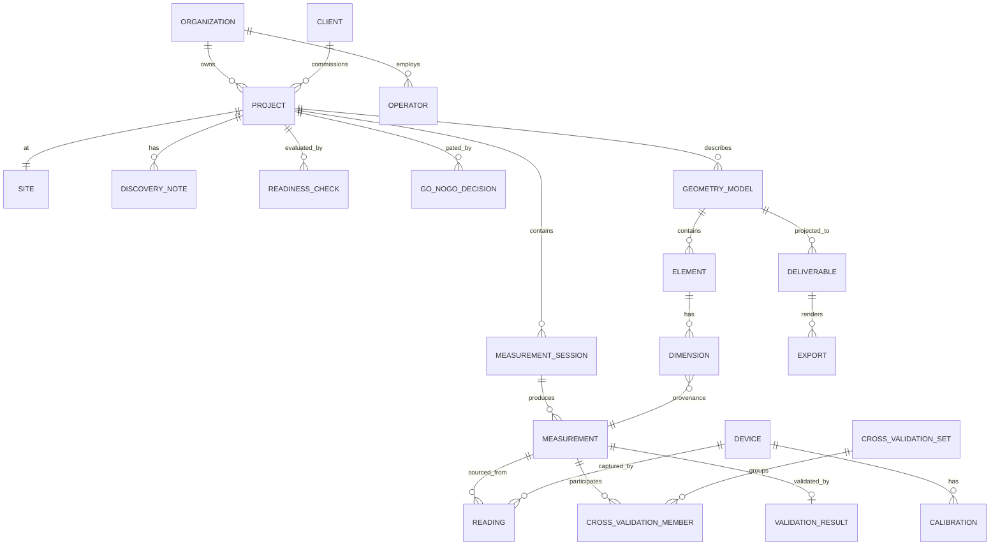

# 07 · מודל הנתונים ובסיס הנתונים

> אסטרטגיית אחסון + סכימה לוגית לסקירה. לא נכתבו מיגרציות. בחירת העמודות משקפת את
> ה-invariants מ[מסמך 02].

## 1. אסטרטגיית אחסון (פוליגלוט, אך משעממת במכוון)

| נתונים | מאגר | מדוע |
|---|---|---|
| דומיין רלציוני מרכזי (פרויקטים, sessions, מדידות, גאומטריה, החלטות) | **PostgreSQL** | invariants חזקים, טרנזקציות, בשלות |
| גאומטריה / קואורדינטות מרחביות | **PostGIS** (הרחבת Postgres) | טיפוסים גאומטריים, שאילתות מרחביות, ללא תשתית חדשה |
| נתוני גילוי גמישים ותוכני מכשירים | עמודות **JSONB** ב-Postgres | אבולוציית סכימה ללא מיגרציות, ועדיין ניתן לשאילתה |
| ענני נקודות (iCS50), מדיה מהאתר, קובצי ייצוא | **Object storage** (תואם-S3) | blobs גדולים לא שייכים לבסיס נתונים; זול, מדורג |
| אירועי דומיין | **טבלת outbox** ב-Postgres → stream | טרנזקציוני יחד עם הכתיבות; אין אובדן אירועים |
| לקוח השדה | **SQLite / WatermelonDB** | מראה מקומית offline-first |

מאגר נתונים ראשי אחד (Postgres) שומר על תפעול פשוט לצוות קטן ([ADR-006](09-ADRs.md)).
ה-object storage מחזיק אך ורק תוצרים גדולים **המופנים אליהם**.

## 2. ERD (לוגי)



## 3. טבלאות מפתח (עמודות מקוצרות; כל שורה עשירה בשרשרת מקור)

```sql
-- בלתי-ניתן-לשינוי, append-only. אבן היסוד של הניתנות-למעקב.
reading (
  id uuid pk,                     -- נוצר בצד הלקוח (בטוח-offline)
  org_id uuid, device_id uuid,
  capability text,
  raw jsonb,                      -- מאומת מול CapabilityProfile.outputSchema
  captured_at timestamptz, operator_id uuid,
  calibration_id uuid,            -- איזה כיול היה בתוקף (I-M4)
  frame_ref text,
  superseded_by uuid null,        -- תיקונים מקושרים קדימה; המקור לעולם לא נמחק (I-M2)
  created_at timestamptz
)

measurement (
  id uuid pk, org_id uuid, session_id uuid,
  quantity text, magnitude_mm bigint,   -- נקודה-קבועה במ״מ, שלם → ללא סחף float (Q11)
  unit text default 'mm', frame_ref text,
  critical boolean,
  automation_level text,          -- Manual | X6 | iCS50
  element_ref uuid null,
  validation_result_id uuid null, -- חייב להיות PASS לפני הזנה לגאומטריה אם critical (I-M1)
  created_at timestamptz
)
measurement_reading (measurement_id uuid, reading_id uuid)  -- שרשרת מקור M:N

cross_validation_set (
  id uuid pk, org_id uuid, fact_ref text,
  tolerance_applied jsonb, delta_mm bigint, within_tolerance boolean,
  outcome text,                   -- AGREE | DISAGREE
  reconciliation jsonb null
)

validation_result (
  id uuid pk, subject_ref uuid, subject_kind text,
  outcome text,                   -- PASS | PASS_WITH_FLAG | FAIL | PENDING
  rule_set_version text,
  evaluations jsonb,              -- קלט+תוצאה לכל כלל (ניתן לביקורת)
  overrides jsonb null,
  evaluated_by text, evaluated_at timestamptz,
  inputs_hash text                -- עמידות-בזיוף (Q13)
)

go_nogo_decision (
  id uuid pk, project_id uuid,
  decision text,                  -- GO | NO_GO  (בלתי-ניתן-לשינוי, I-R3)
  basis_readiness_id uuid,
  reasons text[],                 -- נדרש כאשר NO_GO (I-R2)
  overrides jsonb null,
  decided_by uuid, decided_at timestamptz
)

geometry_model (
  id uuid pk, project_id uuid, revision int,
  frame_ref text, status text,    -- DRAFT | VALIDATED | LOCKED
  locked_at timestamptz null, checksum text null
)
dimension (
  id uuid pk, element_id uuid,
  quantity text, magnitude_mm bigint,
  provenance_measurement_id uuid not null,  -- אין מספרים ללא מקור (I-G1)
  validation text                            -- PASS | PENDING | FAIL
)

device (
  id uuid pk, org_id uuid, vendor text, model text,
  transport text, capabilities jsonb, firmware text
)
calibration (
  id uuid pk, device_id uuid,
  calibrated_at timestamptz, valid_until timestamptz,
  certificate_ref text null, status text
)

outbox (
  id uuid pk, aggregate_ref uuid, type text, schema_version int,
  payload jsonb, occurred_at timestamptz, published_at timestamptz null
)
```

## 4. שרשרת מקור וביקורת (העמודות שאינן ניתנות למשא ומתן)

כל שורה נושאת-מדידה עונה על: **מי, איזה מכשיר, מתי, איזה כיול, איזה אימות,
איזו מערכת כללים.** זה מה שמאפשר ל-Soline להגן על מימד שנים לאחר מכן (Q13).

- `reading` הוא **append-only**; `superseded_by` נותן שושלת תיקונים ללא שינוי.
- `validation_result.inputs_hash` + `export.checksum` מספקים **עמידות-בזיוף** מקצה לקצה.
- החלטות וגאומטריה נעולה הן **בלתי-ניתנות-לשינוי**; שינוי = החלטה חדשה / רוויזיה חדשה.

## 5. ענני נקודות ומדיה (object storage)

```
object: s3://soline/{org}/{project}/{kind}/{id}
db reference: blob_ref(id, uri, bytes, checksum, kind, created_at, retention_until)
```
- סריקות iCS50 נשמרות כ-blobs; בסיס הנתונים מחזיק מטא-דאטה + הפניה לתצוגה מקדימה מדוללת.
- העיבוד (registration, decimation, extraction) הוא **worker אסינכרוני** הכותב חזרה
  blobs נגזרים + מדידות.
- עמודת **מדיניות שמירה** (`retention_until`) מתפעלת את Q9/Q10 (לא לאגור לנצח).

## 6. עמדת רב-דיירות וקנה-מידה
- **`org_id` ברמת השורה** בכל טבלה כבר עכשיו (זול), כך שריבוי-ארגונים הוא מתג-מדיניות בהמשך —
  מבלי להתחייב לתשתית SaaS רב-דיירותית ב-v1 (Q1).
- מועמדים לפרטישן כשהנפח ידרוש: `reading` ו-`outbox` לפי זמן. לא נדרש ביום הראשון.
- מודלי קריאה (KPIs של הדשבורד, סטטוס ייצוא) הם **הקרנות (projections)** מעל אירועים, נשמרים בנפרד
  מהליבה הטרנזקציונית.

## 7. נדחה
- בסיס נתונים ייעודי לסדרות-עתיות (רק אם נפח הטלמטריה יוכיח זאת).
- שירות אינדקס מרחבי לענני-נקודות (רק כאשר סריקת iCS50 בהיקף, Q5).
