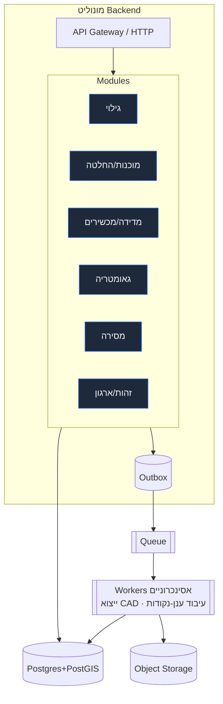
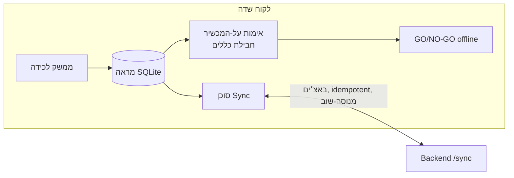

# 08 · ה-Backend והתאמת-העומס

> כיצד זה רץ. הבחירות מעדיפות **צוות קטן המשלֵח נכונה** על פני קנה-מידה מוקדם מדי.

## 1. צורת הפריסה — מונוליט מודולרי ([ADR-001](09-ADRs.md))

Backend אחד הניתן לפריסה; ההקשרים התחומים (bounded contexts) הם **מודולים אכופים** (סכימות/חבילות
נפרדות, ללא גישה חוצת-מודולים לטבלאות — רק דרך APIs/אירועים של המודול). כך מקבלים גבולות DDD בלי
מס מערכות-מבוזרות.

**מדוע לא microservices עכשיו:** תפעול בקנה-מידה של מייסד עם 6 הקשרים אינו מרוויח דבר מגבולות
רשת ומשלם על כך בתפעול, בהשהיה ובדיבוג. תפרי המודולים אומרים שנוכל לחלץ שירות בהמשך *על בסיס ראיות*
(למשל עיבוד ענן-נקודות) ללא כתיבה-מחדש.

## 2. סביבת הריצה והמחסנית (הצעה, פתוחה לשינוי)

- **שפה:** TypeScript (Node). נימוק: משתפת טיפוסים/אימות עם לקוח השדה ועם הדשבורד הקיים;
  מאגר כישרונות אחד. *(אם חישוב כבד של גאומטריה/ענן-נקודות ידומיננטי, שקלו מחדש worker ב-Rust/.NET —
  ראו §5.)*
- **Framework:** framework מודולרי (למשל NestJS) האוכף גבולות מודולים; או מבנה שכבתי דק.
  ההחלטה נדחתה להעדפת הצוות — אינה נושאת-משקל ארכיטקטונית.
- **DB:** PostgreSQL + PostGIS. **Queue:** מבוסס-Postgres (למשל pgboss) בהתחלה — ללא תשתית נוספת —
  לשדרג ל-broker ייעודי רק אם יידרש. **Object storage:** תואם-S3.

## 3. לקוח שדה offline-first (האילוץ המגדיר, Q3)

- **לכידה → אימות → GO/NO-GO** מלא עובד ללא כל קישוריות.
- המאגר המקומי הוא מקור האמת *עד לסנכרון*; השרת סמכותי *לאחר מכן*.
- סוכן ה-sync: יומן מוטציות מסודר, מפתחות idempotency, backoff מעריכי, חשיפת קונפליקטים
  ([מסמך 06] §5). קריאות append-only הופכות 90% מהסנכרון לנטול-קונפליקטים.

## 4. עיבוד אסינכרוני

| עבודה | טריגר | סביבת ריצה |
|---|---|---|
| ייצוא CAD (DXF/DWG/STEP/PDF) | `DeliverableRequested` | worker |
| registration/decimation/extraction של ענן-נקודות | סריקה הועלתה | worker (כבד) |
| אימות-מחדש סמכותי ב-backend | בעת sync | worker/inline |
| פיזור אירועים לדשבורד/CRM/פיננסים | סקירת outbox | worker |

ה-workers מתאימים-עומס **אופקית ובאופן עצמאי** מה-API — המקום הראשון בו נוסיף קיבולת.

## 5. נתיב התאמת-העומס (scaling) (רק כשהראיות דורשות)

מדורג, כל צעד מוצדק על ידי מדד — לא מראש:

1. התאמת-עומס **אנכית** של Postgres + read replicas לדשבורדים/הקרנות.
2. **פרטישן** ל-`reading`/`outbox` לפי זמן.
3. **חילוץ** מעבד ענן-הנקודות לשירות משלו (הכבד ביותר, הניתן-לבידוד ביותר; ייתכן
   בשפה אחרת עבור חישוב).
4. **הקשחת רב-דיירות** (בידוד ארגונים כבר בסכימה דרך `org_id`).
5. **message broker** ייעודי אם תפוקת ה-outbox-על-Postgres תיחרג.

> אנו **במפורש לא** מתחילים בצעד 5. נכונות ועמידות offline הן בעיות היום-הראשון;
> תפוקה היא בעיה מאוחרת ומבורכת.

## 6. סוגיות חוצות-מערכת

- **אבטחה:** אימות מוגבל-ארגון, גישה מבוססת-תפקידים, webhooks חתומים, כתובות URL חתומות-מראש
  להעלאה, הצפנה במנוחה (blobs + DB) ובתעבורה. מכשירי השדה מחזיקים רק את נתוני הארגון שלהם.
- **נצפוּת (observability):** לוגים מובנים, מטריקות, traces עם `traceId` המשתרע מלקוח-השדה →
  API → workers → אירועים. התרעה על שיעור `CrossValidationFailed`, פיגור sync, כשלי ייצוא.
- **אמינות:** outbox טרנזקציוני (אין אובדן אירועים); הכול idempotent; גיבויים + PITR
  ב-Postgres; ניהול גרסאות ב-object storage עבור תוצרי מסירה.
- **ממשל נתונים:** עבודת אכיפת `retention_until`; רישום גישה למדיה מהאתר (Q10).
- **DR:** יעדי RPO/RTO ייקבעו עם העסק; מדידות בלתי-ניתנות-לשחזור → הטיה לכיוון
  גיבויים תכופים + עיצוב append-only.

## 7. סביבות ומשלוח
- סביבות: local → staging → prod. תשתית-כקוד. ה-CI מריץ lint לגבולות-המודול
  (ללא ייבוא חוצה-מודולים), בדיקות חוזה על ה-ports, ובדיקות מיגרציית-סכימה.
- **דבר כאן אינו נבנה עד לאישור המפרטים** — מסמך זה מגדיר את מודל התפעול היעד,
  לא סדר בנייה.
