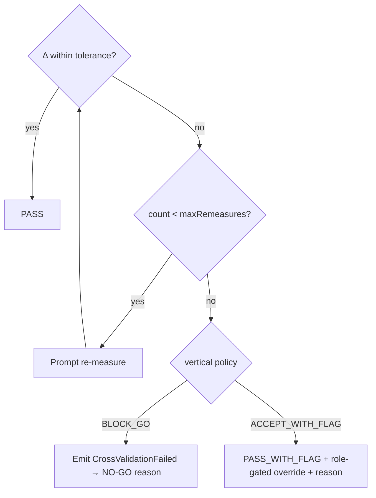

# 11 · הצעת-בסיס למערך כללי האימות (Strawman — הצעה קונקרטית)

> **מטרה:** להפוך את מנוע האימות המופשט ([doc 04](04-Validation-Engine.md)) למספרים
> קונקרטיים שניתן להגיב עליהם. **כל מה שכאן הוא STRAWMAN (הצעת-בסיס)** — ברירות מחדל מוצעות
> שמומחה התחום *יתקן*, ולא ימציא מאפס. שום דבר אינו ממומש.
>
> ⚠️ **המספרים האלה הם placeholders הנדסיים, לא הטולרנסים המחייבים של Soline.** הם קיימים כדי
> שהשיחה תהיה "שנה 2 מ״מ ל-1.5 מ״מ", ולא "מה זה בכלל צריך להיות?".

---

## 1. מחלקות אמון של התקנים (מוצע)

מזין את שקלול האימות הצולב ואת בחירת הנתב ([doc 03](03-Device-Plugin-Architecture.md)).

| התקן | יכולת | דיוק טיפוסי* | trustClass מוצע (1–5) |
|---|---|---|---|
| Manual (סרט) | `distance.point-to-point` | ±3–5 מ״מ, תלוי-מפעיל | **2** |
| Manual (לייזר ידני) | `distance.point-to-point` | ±2 מ״מ | **3** |
| Leica **D2** | `distance.point-to-point` | ±1.5–2 מ״מ | **4** |
| Leica **X6** (מרחק ישיר) | `distance.point-to-point` | ±1–2 מ״מ | **4** |
| Leica **X6** (גיאומטריה/שטח נגזרים) | `point.3d`, `area.derived` | השגיאה מצטברת עם הגיאומטריה | **3** |
| **iCS50** (סריקה רשומה) | `scan.pointcloud` | ±2–3 מ״מ לאחר רישום | **4** |

*דיוק = **טרם אושר מול SDK/מפרטים של ההתקנים הממשיים (Q4/Q5)**. אין להתייחס לכך כאל עובדה.

**כלל:** מדידה `critical` בוורטיקל צמוד דורשת מקור אחד לפחות של trustClass ≥ 4.

---

## 2. טבלת טולרנסים (ברירות מחדל מוצעות, לכל ורטיקל)

זו התשובה ל-**Q6**, כטבלה לעריכה. `resolve(vertical, quantity, critical)` → Tolerance.
סף ההסכמה = `max(absoluteMm, relativePct% × nominal)`.

| ורטיקל | אורך קריטי | אורך כללי | זווית | נימוק (strawman) |
|---|---|---|---|---|
| **ייצור אבן** (משטחי עבודה) | **±1.5 מ״מ** | ±3 מ״מ | ±0.3° | הלוח נחתך פעם אחת; אי-התאמה = פסולת |
| **זכוכית** | **±1.5 מ״מ** | ±3 מ״מ | ±0.3° | פאנלים בלתי ניתנים להתאמה |
| **אלומיניום** (חלונות/פרופילים) | **±2 מ״מ** | ±4 מ״מ | ±0.5° | קיימת התאמת מסגרת מסוימת |
| **מטבחים** (נגרות) | **±3 מ״מ** | ±5 מ״מ | ±0.5° | פאנלי מילוי בולעים מרווח; ממשק המשטח הדוק יותר |
| **אדריכלות** (as-built) | **±5 מ״מ** | ±10 מ״מ | ±1° | תלוי בקנה מידה של השרטוט |
| **בנייה** (כללי) | **±10 מ״מ** | ±25 מ״מ | ±1° | קנה מידה מבני |

> עמודת "האורך הקריטי" היא **סף ההסכמה של האימות הצולב** למדידה `critical`. דוגמה: הקצה
> האחורי של משטח אבן נמדד ב-X6 (2 743 מ״מ) וב-D2 (2 739 מ״מ) → Δ = 4 מ״מ > 1.5 מ״מ →
> **אי-הסכמה**. אותם מספרים במטבח (±3 מ״מ) → עדיין אי-הסכמה; רק תחת אדריכלות (±5 מ״מ)
> הייתה מתקבלת הסכמה.

---

## 3. מדיניות יישוב (מוצעת, לכל ורטיקל) — עונה על Q7

מה קורה כאשר מקורות בלתי-תלויים אינם מסכימים מעבר לטולרנס.

| ורטיקל | onDisagree | maxRemeasures | עקיפה מותרת ל | נדרש נימוק |
|---|---|---|---|---|
| אבן, זכוכית | `REQUIRE_REMEASURE` → ואז `BLOCK_GO` | 2 | ראש צוות בלבד | ✅ |
| אלומיניום, מטבחים | `REQUIRE_REMEASURE` → ואז `ACCEPT_WITH_FLAG` | 1 | ראש צוות | ✅ |
| אדריכלות, בנייה | `ACCEPT_WITH_FLAG` (תיעוד ה-delta) | 0 | מפעיל | ✅ |

---

## 4. כללי סבירוּת (שפיוּת גיאומטרית — לתפוס שגיאות שהטולרנס אינו יכול)

בלתי-תלויים באימות הצולב; אלו תופסים טעויות *שיטתיות* (נקודה שגויה, ספרות שהוחלפו). ברירות
מחדל מוצעות:

| כלל | בדיקה | סף ברירת מחדל |
|---|---|---|
| **קירות-נגדיים-שווים** | \|wall_A − wall_C\| עבור מלבן נומינלי | ≤ פי 2 מהטולרנס הכללי |
| **עקביות אלכסונים** | האלכסון הנמדד מול √(w²+h²) מן הצלעות | ≤ פי 3 מהטולרנס הקריטי |
| **סכום-החלקים** | Σ(מקטעים) = המפתח הכולל | ≤ הטולרנס הקריטי |
| **זווית-ישרה** | זווית הפינה מול 90° (במקום שמונח ריבוע) | ≤ טולרנס הזווית של הוורטיקל |
| **מרווח מונוטוני** | מרווחים ורטיקליים לאורך הרשת אינם קופצים באופן בלתי-סביר | קפיצה > 20 מ״מ → סימון |
| **שפיוּת טווח** | הערך בתוך טווח ההתקן והסבירוּת הפיזית (למשל 0 < קיר < 30 מ׳) | גבולות קשיחים |

כלל סבירוּת שנכשל הוא **WARNING** (מוצג למפעיל), אלא אם הוגדר כ-BLOCKER למימדים קריטיים.

---

## 5. רשימת תיוג מוכנות לכל ורטיקל (מערך שלמות ה-GO/NO-GO)

עונה על "מה פירוש *מוכן*" (שאלת האתגור שלי מ-doc 10). פריטים מוצעים — `R` = נדרש.

**משותף (כל הוורטיקלים)**
- `R` הרצפה נגישה וניתנת למדידה
- `R` התקרה נגישה (או מסומנת במפורש כ-N/A)
- `R` כל הקירות הרלוונטיים נגישים
- `R` תאורה/חשמל מספקים להפעלת ההתקן
- `R` האתר בטוח ומפונה דיו למדידה
- `R` תוכניות זמינות **או** "אין תוכניות" מתועד עם נימוק

**ייצור אבן (נוסף)**
- `R` ארונות/תשתית תומכים מותקנים **ומפולסים**
- `R` מיקומי חיתוך של כיור/כיריים/ברז ידועים
- מצב גימור הקיר (מרוצף/לא מרוצף) מתועד

**מטבחים (נוסף)**
- `R` פריסת הארונות מאושרת
- `R` מיקומי תשתית (אינסטלציה/חשמל) נלכדו
- מפרטי מכשירי חשמל זמינים

**זכוכית / אלומיניום (נוסף)**
- `R` הפתח שלם מבחינה מבנית
- `R` סטיית הריבוע נמדדה (שני האלכסונים)
- מצב הגליף/המסגרת מתועד

**אדריכלות (נוסף)**
- `R` דאטום/נקודת ייחוס של האתר נקבעו
- `R` היקף ה-as-built מוגדר

**בנייה (נוסף)**
- `R` מוכנות מבנית מאושרת
- `R` מרווח בטיחות/היתר קיימים

**כלל השער:** כל פריט `R` בלתי-פתור = **NO-GO** עם אותו פריט כנימוק (אלא אם תועדה עקיפה
מנומקת ותחומת-תפקיד).

---

## 6. דוגמה מעובדת (מקצה-לקצה, מטבח מול אבן)

מרווח ורטיקלי בנקודת רשת C, מהרצפה→תקרה:

| מקור | קריאה | |
|---|---|---|
| X6 (Process A, נגזר-גיאומטרית) | 2 743 מ״מ | |
| D2 (Process B, ישיר) | 2 739 מ״מ | Δ = **4 מ״מ** |

- **כמטבח** (טולרנס קריטי ±3 מ״מ): 4 > 3 → אי-הסכמה → `REQUIRE_REMEASURE` (פעם 1).
  מדידה חוזרת של D2 → 2 742 מ״מ, Δ = 1 מ״מ → **PASS**. המימד מאומת, provenance = שתי הקריאות.
- **כאבן** (טולרנס קריטי ±1.5 מ״מ): 4 > 1.5 → אי-הסכמה → מדידה חוזרת עד פעמיים; אם עדיין
  > 1.5 → `BLOCK_GO`, `CrossValidationFailed` נפלט, ראש הצוות רשאי לעקוף *עם נימוק* בלבד.

אותם נתונים, ורטיקלים שונים, תוצאות שונות — **משום שהטולרנס הוא נתון, לא קוד.** תכונה זו היא
מה שהופך את Soline לפלטפורמה ולא לאפליקציית מטבחים.

---

## 7. מה אני צריך ממומחה התחום (כדי לקדם זאת מ-strawman → מפרט)

1. לתקן את **טבלת הטולרנסים** (§2) — אלו המספרים שמגדירים את איכות המוצר.
2. לאשר/להתאים את **מדיניות היישוב** (§3) — במיוחד "BLOCK_GO מול סימון" לכל ורטיקל.
3. לאמת את **רשימות תיוג המוכנות** (§5) — אתה יודע מה פירוש "מוכן" טוב מכל מסמך.
4. לאשר את **דיוקי ההתקנים** (§1) לאחר שמחקר ה-SDK/מפרט (Q4/Q5) יבשיל.

לאחר ש-§2–§5 יאושרו, למנוע האימות יהיה מפרט אמיתי ובר-בדיקה, ונוכל להעביר את ADR-005
מ-*Proposed* ל-*Accepted*.
