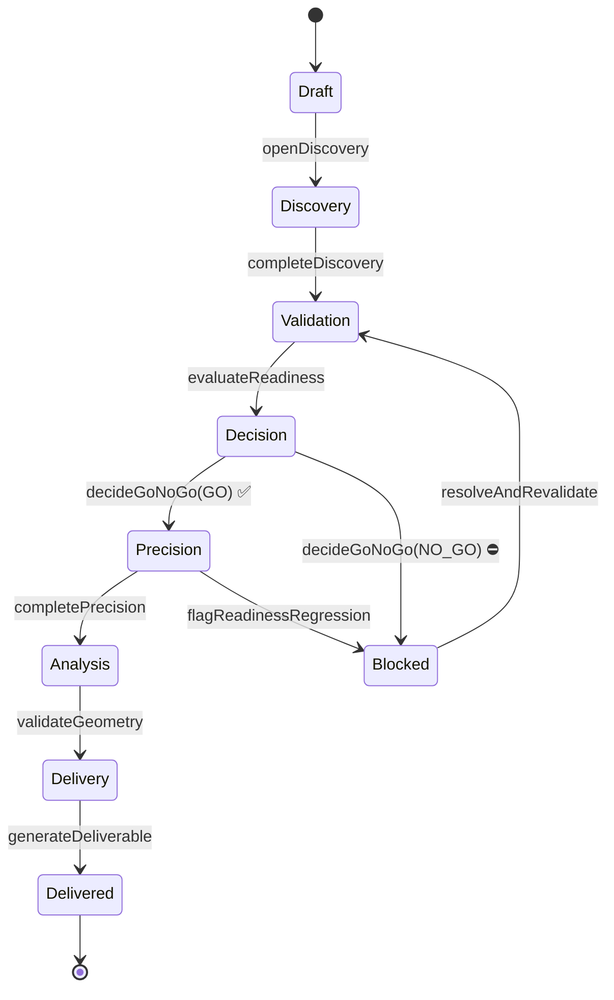

# 15 · מודל הדומיין ומכונת המצבים — מפרט-קוד (Session 3)

> **סטטוס:** מפרט לבנייה — *Session 3*.
> **כלל-על:** אין מימוש לוגיקה עסקית. אלו טיפוסים, שמירות (guards) כחתימות, וטבלאות-מעבר.
> זה מעמיק את [מסמך 02](02-Domain-Model-and-Workflow.md) לחוזה מדויק שעליו נשענים גם
> ליבת האימות ([13](13-Validation-Core-Spec.md)) וגם חוזה הסנכרון ([14](14-Sync-and-Offline-Contract.md)).

---

## 1. עצמי-ערך קנוניים (Value Objects)

טיפוסים בלתי-משתנים, מאומתים בקצה. הם המילון של כל הדומיין.

```ts
type Uuid = string;                          // v4, נוצר-בלקוח

// אורך תמיד כמילימטרים שלמים (ADR-007) — ללא float, ללא יחידות מעורבות.
interface Quantity { magnitudeMm: number; unit: 'mm'; frameRef: FrameRef; }
type FrameRef = string;                      // מזהה מערכת הצירים של האתר

type Vertical = 'kitchen' | 'stone';         // v1 (אחרים מתוכננים, מסמך 12)
type QuantityKind = 'LENGTH'|'HEIGHT'|'CLEARANCE'|'ANGLE'|'AREA'|'POINT3D';
type Role = 'OPERATOR' | 'LEAD' | 'ADMIN' | 'READONLY';
type AutomationLevel = 'Manual' | 'X6' | 'iCS50';

// גרסת מצב אופטימית — זו ה-baseVersion שהסנכרון בודק (מסמך 14 §6).
type Version = number;
```

---

## 2. אגרגטים כטיפוסים + אינווריאנטות

לכל אגרגט: הטיפוס, ורשימת האינווריאנטות שחייבות להתקיים תמיד (מזוהות מ[מסמך 02]).

```ts
interface Project {
  id: Uuid; orgId: Uuid; clientId: Uuid; siteId: Uuid;
  vertical: Vertical;
  status: ProjectStatus;        // §3
  version: Version;             // עולה בכל פקודה שהתקבלה
  createdAt: string; updatedAt: string;
}
```
**אינווריאנטות** — I-P1: מעברים רק לאורך מכונת המצבים (§3). I-P2: אין `PRECISION` ללא
`GoNoGoDecision(GO)` שמפנה לפרויקט.

```ts
interface GoNoGoDecision {          // בלתי-משתנה (I-R3)
  id: Uuid; projectId: Uuid;
  decision: 'GO' | 'NO_GO';
  basisReadinessId: Uuid;
  reasons: string[];              // חובה כאשר NO_GO (I-R2)
  overrides?: Override[];
  decidedBy: Uuid; decidedAt: string;
}
interface Measurement {
  id: Uuid; sessionId: Uuid; elementRef?: Uuid;
  quantity: QuantityKind; value: Quantity;
  critical: boolean; automationLevel: AutomationLevel;
  readingIds: Uuid[];             // שרשרת מקור
  validationResultId?: Uuid;      // חייב PASS לפני הזנה לגאומטריה אם critical (I-M1)
}
interface GeometryModel {
  id: Uuid; projectId: Uuid; revision: number;
  frameRef: FrameRef; status: 'DRAFT'|'VALIDATED'|'LOCKED';
}
```
**אינווריאנטות מפתח:** I-M1 (מדידה קריטית → validation PASS לפני גאומטריה) · I-M2 (Reading
append-only) · I-G1 (Dimension ללא provenance אסור) · I-G2 (`VALIDATED` דורש כל Dimension=PASS) ·
I-G3 (`LOCKED` בלתי-משתנה) · I-D1 (Deliverable רק מגאומטריה מאומתת/נעולה).

---

## 3. מכונת המצבים של הפרויקט

```ts
type ProjectStatus =
  | 'Draft' | 'Discovery' | 'Validation' | 'Decision'
  | 'Precision' | 'Analysis' | 'Delivery' | 'Delivered' | 'Blocked';
```

**טבלת המעברים (מקור האמת של תהליך העבודה):**

| ממצב | פקודה | שמירה (guard) | למצב | אירוע |
|---|---|---|---|---|
| Draft | `openDiscovery` | — | Discovery | `ProjectOpened` |
| Discovery | `completeDiscovery` | שדות גילוי נדרשים קיימים; ≥1 תוכנית או דגל "אין תוכניות" | Validation | `DiscoveryCompleted` |
| Validation | `evaluateReadiness` | רשימת התיוג הורצה מול הגרסה הנוכחית | Decision | `ReadinessEvaluated` |
| Decision | `decideGoNoGo(GO)` | `ReadinessCheck ≠ FAIL` **או** Override מאושר (I-R1) | Precision | `GoNoGoDecided` |
| Decision | `decideGoNoGo(NO_GO)` | `reasons.length ≥ 1` (I-R2) | Blocked | `GoNoGoDecided` |
| Blocked | `resolveAndRevalidate` | — | Validation | `ProjectUnblocked` |
| Precision | `completePrecision` | אין מדידה `critical` עם validation ≠ PASS (I-M1) | Analysis | `PrecisionCompleted` |
| Precision | `flagReadinessRegression` | למשל `CrossValidationFailed` | Blocked | `ProjectBlocked` |
| Analysis | `validateGeometry` | `GeometryModel.status = VALIDATED` (I-G2) | Delivery | `GeometryValidated` |
| Delivery | `generateDeliverable` | גאומטריה `VALIDATED`/`LOCKED` (I-D1) | Delivered | `DeliverableExported` |



---

## 4. חוזה הפקודות (טהור, אופטימי-לגרסה)

```ts
// פונקציה טהורה: מצב + פקודה → מצב חדש + אירועים, או דחייה מטופסת.
function applyCommand(
  project: Project,
  cmd: Command,
  ctx: CommandContext
): Result<{ project: Project; events: DomainEvent[] }, Rejection>;

interface Command {
  name: CommandName;
  projectId: Uuid;
  baseVersion: Version;          // אופטימי — נבדק מול project.version (סנכרון §6)
  payload: unknown;
  issuedBy: Uuid; issuedAtTs: string;   // זמן מוזרק
}
type Rejection =
  | { kind: 'version-mismatch'; current: Version }   // → conflict בסנכרון
  | { kind: 'guard-failed'; ruleId: string; detail: string }
  | { kind: 'illegal-transition'; from: ProjectStatus; command: CommandName };
```
**כללי הזהב:**
1. `baseVersion ≠ project.version` → `version-mismatch` (הסנכרון הופך זאת ל-conflict, מסמך 14 §6).
2. שמירה נכשלת → `guard-failed` עם `ruleId` מפורש. אין מעבר.
3. הצלחה → `project.version++`, פליטת אירוע. הפקודה עצמה **אינה** מבצעת I/O.

---

## 5. אירועי דומיין (מעטפת אחידה)

```ts
interface DomainEvent<T = unknown> {
  id: Uuid; type: EventType; schemaVersion: number;
  orgId: Uuid; aggregateRef: Uuid;
  occurredAtTs: string; traceId: string;
  data: T;
}
```
| אירוע | מתי | צרכנים בולטים |
|---|---|---|
| `ProjectOpened` | פרויקט חדש | דשבורד, CRM |
| `DiscoveryCompleted` | סיום גילוי | מוכנות |
| `ReadinessEvaluated` | הרצת רשימת תיוג | ממשק ההכרעה |
| `GoNoGoDecided` | הכרעת שער | מדידה, CRM, דשבורד, ביקורת |
| `MeasurementRecorded` | מדידה נשמרה | גאומטריה, אנליטיקה |
| `CrossValidationFailed` | אי-הסכמה מעל טולרנס | התראת מפעיל, ביקורת |
| `GeometryValidated` | מודל אומת במלואו | מסירה |
| `DeliverableExported` | ייצוא הופק | CRM (עבודה הסתיימה), כספים (בר-חיוב), לקוח |
| `ValidationDivergence` | פער on-device↔backend | ביקורת (מסמך 14 §7) |

האירועים הם **עובדות בזמן עבר**, בלתי-משתנים, מגורסאים; נפלטים דרך ה-outbox (מסמך 07/08).

---

## 6. נקודות אכיפת האינווריאנטות (מי בודק, איפה)

| אינווריאנטה | נאכפת ב | כיצד |
|---|---|---|
| I-P2 (אין Precision ללא GO) | `applyCommand`, guard של `decideGoNoGo`/`completePrecision` | בדיקת קיום `GoNoGoDecision(GO)` |
| I-M1 (קריטי → PASS) | guard של `completePrecision` + הזנת גאומטריה | סינון מדידות עם validation ≠ PASS |
| I-M2 (Reading append-only) | שכבת האחסון + סנכרון | ללא UPDATE/DELETE; רק `superseded_by` |
| I-G1 (אין Dimension חסר-מקור) | בניית גאומטריה | דחיית Dimension ללא `provenanceMeasurementId` |
| I-G2/I-G3 (נעילה/אימות) | guard של `validateGeometry` + נעילה | סטטוס מודל + אי-שינוי |
| I-R2/I-R3 (NO_GO מנומק, החלטות בלתי-משתנות) | guard של `decideGoNoGo` | חובת reasons; החלטה חדשה במקום עריכה |

---

## 7. תרחישי קבלה (מכונת המצבים)

| # | תרחיש | פלט צפוי |
|---|-------|----------|
| DM-1 | `decideGoNoGo(GO)` ממצב Validation | `illegal-transition` (חייב לעבור דרך Decision) |
| DM-2 | `decideGoNoGo(NO_GO)` ללא reasons | `guard-failed: I-R2` |
| DM-3 | `completePrecision` עם מדידה קריטית PENDING | `guard-failed: I-M1` |
| DM-4 | פקודה עם `baseVersion` ישן | `version-mismatch` + current |
| DM-5 | מסלול מלא Draft→…→Delivered | רצף אירועים תקין, `version` עולה בכל שלב |
| DM-6 | `decideGoNoGo(GO)` עם ReadinessCheck=FAIL ללא Override | `guard-failed: I-R1` |
| DM-7 | אותה פקודה מיושמת פעמיים (אידמפוטנטיות) | יישום שני חסר-אפקט (דה-דופ לפי clientMutationId) |

---

## 8. Definition of Done

1. כל האגרגטים כטיפוסים; `applyCommand` טהורה ומחזירה `Result` מטופס.
2. טבלת המעברים (§3) ממומשת אחד-לאחד; מעבר לא-חוקי → `illegal-transition`.
3. כל שמירה מחזירה `ruleId` מפורש; אין כשל שקט.
4. `baseVersion`/`version` תומכים בקונקורנטיות אופטימית של הסנכרון (מסמך 14).
5. כל אירוע נפלט עם מעטפת אחידה ל-outbox.
6. כל 7 תרחישי הקבלה (§7) עוברים.

> **עדיין ללא לוגיקה עסקית מיושמת** — זהו המפרט. הבנייה מתחילה עם אישור המפרטים.
