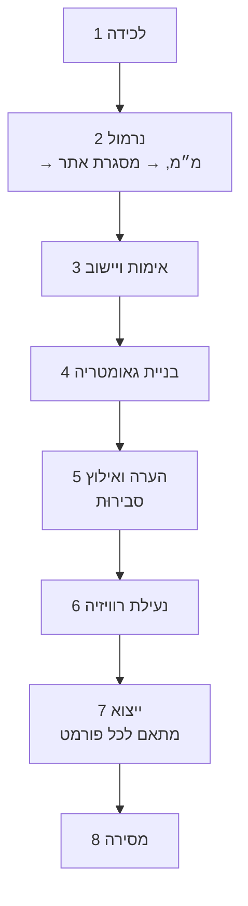

# 17 · צינור הגאומטריה ומתאמי הייצוא — מפרט-קוד (Session 3)

> **סטטוס:** מפרט לבנייה — *Session 3*.
> **כלל-על:** אין מימוש לוגיקה עסקית. חוזי צינור, טיפוסי הגאומטריה הקנונית, ומתאמי DXF/PDF.
> **עיקרון מכונן:** *ידע לפני CAD.* הגאומטריה המאומתת היא **מקור האמת**; ה-CAD הוא **היטל**
> (ADR-004). מעמיק את [מסמך 05](05-CAD-Pipeline.md). ייצוא v1 = **DXF + PDF** (מסמך 12).

---

## 1. המודל הגאומטרי הקנוני (מקור האמת)

בלתי-תלוי בכל פורמט CAD. מינימלי, מדויק, אגנוסטי-לגרעין.

```ts
interface GeometryModel {
  id: Uuid; projectId: Uuid; revision: number;
  frameRef: FrameRef; status: 'DRAFT' | 'VALIDATED' | 'LOCKED';
  lockedAtTs?: string; checksum?: string;      // נקבע בנעילה
}
interface Element {
  id: Uuid;
  kind: 'WALL'|'FLOOR'|'CEILING'|'OPENING'|'OBSTACLE'|'CUSTOM';
  sketch: Path2D | Mesh3D;                      // דו-ממד-תחילה; תלת-ממד היכן שנדרש
  dimensions: Dimension[];
  constraints: Constraint[];
  createdBy: 'MANUAL' | 'X6';                   // מטא-נתון בלבד — הייצוג זהה
}
interface Dimension {
  id: Uuid; quantity: QuantityKind; value: Quantity;    // מ״מ, במסגרת האתר
  provenanceMeasurementId: Uuid;               // חובה — אין מספרים חסרי-מקור (I-G1)
  validation: 'PASS' | 'PENDING' | 'FAIL';
}
interface Constraint { kind:'PARALLEL'|'PERP'|'EQUAL'|'SUM'|'DIAGONAL'; refs: Uuid[]; }
```

---

## 2. שלבי הצינור (חוזה לכל שלב)



| שלב | קלט | פלט | חוזה |
|---|---|---|---|
| 2 נרמול | קריאות גולמיות | כמויות קנוניות | המרה **רק** בקצה (ADR-007); מסלק ערבוב יחידות |
| 3 אימות | מדידות | `ValidationResult` | שער; כשלים חוזרים בלולאה ([מסמך 13](13-Validation-Core-Spec.md)) |
| 4 בנייה | מדידות **מאומתות** | `GeometryModel(DRAFT)` | פונקציה טהורה (§3 להלן) |
| 5 הערה | גאומטריה | גאומטריה מאולצת | אילוצי סבירוּת = בדיקות יתירות (מסמך 13 §4.4) |
| 6 נעילה | גאומטריה מאומתת | `GeometryModel(LOCKED)` | בלתי-משתנה + `checksum` (I-G3) |
| 7 ייצוא | גאומטריה נעולה | קובצי פורמט | מתאמים טהורים ודטרמיניסטיים (§4) |
| 8 מסירה | ייצואים | `Deliverable` | מקבע `geometryRevision` + `checksum` (I-D2) |

---

## 3. חוזה הבנייה והנעילה (טהור)

```ts
function buildGeometry(input: {
  validatedMeasurements: Measurement[];        // כולן עם validation = PASS
  discovery: DiscoveryFacts;
  frameRef: FrameRef;
}): GeometryModel;                             // status = DRAFT

function validateGeometry(model: GeometryModel): Result<GeometryModel, GeoRejection>;
//  → VALIDATED רק אם כל Dimension.validation === 'PASS' (I-G2)

function lockGeometry(model: GeometryModel /* VALIDATED */): GeometryModel;
//  → LOCKED + checksum; שינוי עתידי יוצר revision חדש (I-G3)
```
**אכיפות:** I-G1 (כל Dimension חייב `provenanceMeasurementId`) · I-G2 (VALIDATED דורש הכל PASS) ·
I-G3 (LOCKED בלתי-משתנה). `buildGeometry` אינו מבצע I/O.

---

## 4. מתאמי הייצוא (ports & adapters)

```ts
interface ExportAdapter {
  format: 'DXF' | 'PDF' | 'CSV' | 'DWG' | 'STEP' | 'VENDOR';
  export(model: GeometryModel /* VALIDATED|LOCKED */, opts: ExportOptions): Promise<ExportArtifact>;
}
interface ExportArtifact {
  format: string; blobRef: BlobRef; checksum: string;
  geometryRevision: number; generatedAtTs: string;
}
```
**כללים חוצי-מתאמים:**
- ייצוא רק מגאומטריה `VALIDATED`/`LOCKED` (I-D1) — לעולם לא מ-`DRAFT`.
- **היטלים טהורים ודטרמיניסטיים:** אותו מודל → אותם בתים → אותו `checksum`. סדר אלמנטים יציב;
  חותמת-זמן מוזרקת ולא משנה בתים משמעותית.
- ייצואים כבדים רצים כ**worker אסינכרוני** (מסמך 08) — נתיב ה-API נשאר קשוב.

### 4.1 מתאם DXF (חובה ל-v1)
- מיפוי אלמנטים → ישויות DXF: `WALL`→`LWPOLYLINE`, `OPENING`→בלוק, מידות→ישויות `DIMENSION`,
  תוויות→`TEXT`.
- **שכבות (layers) לפי `Element.kind`** (WALL/FLOOR/CEILING/OPENING…) — כך היצרן מסנן.
- **יחידות:** `INSUNITS = 4` (מ״מ). קנה-מידה 1:1 בערכים קנוניים.
- דטרמיניזם: מיון אלמנטים לפי `id`; אין ערכים תלויי-סביבה.

### 4.2 מתאם PDF (חובה ל-v1)
- שרטוט ממודד + **title block** (פרויקט, רוויזיה, תאריך) + **סיכום שרשרת מקור**: אילו התקנים,
  סטטוס אימות לכל מידה קריטית, ודגלים (`PASS_WITH_FLAG`). ללקוח/לאדם.

### 4.3 CSV (רשימת חיתוך) — מיד-אחרי v1. DWG/STEP/ספק — דרך מתאמים נוספים בהמשך.

---

## 5. חוזה המסירה (Deliverable)

```ts
interface Deliverable {
  id: Uuid; projectId: Uuid;
  geometryRevision: number;                    // מקובע (I-D2)
  exports: ExportArtifact[];
  status: 'DRAFT'|'ISSUED'|'SUPERSEDED';
  supersededBy?: Uuid;
}
```
- כל `Export` נושא `checksum` + `geometryRevision` → יצרן יכול להוכיח מאיזו אמת נגזר החלק שלו
  (הגנה מפני אחריות, Q13).
- תוצר שהוחלף נשמר (ביקורת), מסומן `SUPERSEDED`.

---

## 6. לקנות/לעטוף את גרעין ה-CAD (ADR-004)

- אנו בעלים של **המודל הגאומטרי המאומת בלבד** (הקניין/החפיר). ייצור ה-DXF/PDF = מתאם מעל
  ספרייה מורשית/OSS. מועמדים להערכה במסלול Gemini.
- **תפר:** אם ייבנה גרעין בעתיד, רק המתאמים משתנים; המודל הקנוני יציב.

---

## 7. תרחישי קבלה

| # | תרחיש | פלט צפוי |
|---|-------|----------|
| GP-1 | בנייה ממדידות מאומתות | כל Dimension עם `provenanceMeasurementId` (I-G1); אין חסרי-מקור |
| GP-2 | Dimension קריטי PENDING | המודל אינו מגיע ל-`VALIDATED` (I-G2) |
| GP-3 | נעילה ואז ניסיון עריכה | נדחה; נדרש `revision` חדש (I-G3) |
| GP-4 | ייצוא DXF פעמיים לאותו מודל | `checksum` זהה (דטרמיניזם) |
| GP-5 | בדיקת DXF | `INSUNITS=4` (מ״מ); שכבות לפי `kind` |
| GP-6 | Deliverable | מקבע `geometryRevision` + `checksum` (I-D2) |
| GP-7 | ייצוא מגאומטריה `DRAFT` | נדחה (I-D1) |
| GP-8 | PDF | כולל title block + סיכום שרשרת מקור/אימות |

---

## 8. Definition of Done

1. מודל גאומטרי קנוני כטיפוסים; `buildGeometry`/`validateGeometry`/`lockGeometry` טהורות.
2. אכיפת I-G1/I-G2/I-G3/I-D1/I-D2 בנקודות המפורטות.
3. מתאמי **DXF + PDF** מיישמים `ExportAdapter`; דטרמיניסטיים; רק מגאומטריה מאומתת/נעולה.
4. DXF במ״מ עם שכבות לפי kind; PDF עם שרשרת מקור.
5. Deliverable מקבע רוויזיה + checksum; תוצרים שהוחלפו נשמרים.
6. כל 8 תרחישי הקבלה (§7) עוברים.

> **עדיין ללא לוגיקה עסקית מיושמת** — זהו המפרט. הבנייה מתחילה עם אישור המפרטים.
