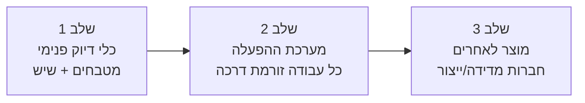
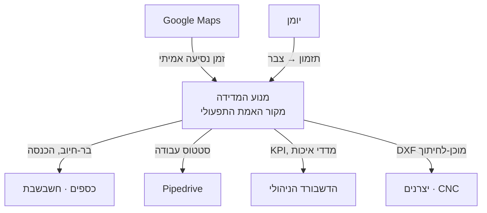

# 18 · חזון המוצר והתפתחותו

> **סטטוס:** מסמך חזון — פיתוח הרעיון קדימה. לא ארכיטקטורה ולא מפרט; זו התשובה ל*למה זה קיים,
> לאן זה הולך, ומדוע זה מנצח*. הוא מסגר את כל המפרטים הטכניים (13–17) בתוך סיפור מוצר אחד.

---

## 1. הרעיון בגרעינו — לא מוכרים מדידה, מוכרים **ודאות**

מתחרה עם מטר וסרט מוכר "מספרים". Soline מוכרת דבר אחר לגמרי: **ודאות שהמספר נכון, מוכחת,
ומגובה.** המוצר האמיתי אינו המדידה — הוא **הגאומטריה המאומתת עם שרשרת המקור**: מסמך שאומר
"המידה הזו נמדדה בשני מכשירים בלתי-תלויים, הסכימו בתוך 1.5 מ״מ, המכשירים היו מכוילים, וזה מי
שמדד ומתי."

זה משנה את השאלה מ"כמה זה עולה למדוד?" ל"כמה עולה טעות?" — ולוח שיש שהרוס עולה פי מאה ממדידה.
**כל הארכיטקטורה נגזרת מהרעיון הזה:** שער GO/NO-GO, אימות צולב, שרשרת מקור בלתי-ניתנת-לזיוף —
כולם מנגנונים למכירת ודאות.

---

## 2. חוויית השדה (יום בחיי מפעיל)

הרעיון חי או מת בשטח. כך הוא מרגיש:

1. **לפני הנסיעה** — האפליקציה כבר יודעת: פרויקט שיש, קומה 13, גישה מוגבלת. מציגה את רשימת
   המוכנות ואת הסיכונים הצפויים *מתוך פרויקטים דומים בעבר*.
2. **בשטח, ללא קליטה** — המפעיל עובר את רשימת המוכנות. משהו לא מוכן? **NO-GO** במקום, עם סיבה.
   הוא לא בזבז יום — הוא חוסך חזרה.
3. **מצב דיוק** — מודד ב-X6 וב-D2. האפליקציה משווה בזמן אמת: "הסכמה, 1 מ״מ, אושר" ✅ או
   "פער 4 מ״מ — מדוד שוב" ⚠️. הוא לא מגלה טעות שבועיים אחר כך אצל היצרן.
4. **בדרך חזרה** — הכל מסונכרן אוטומטית ברגע שיש קליטה. הגאומטריה נבנית, ה-DXF מוכן ליצרן,
   הדשבורד הניהולי כבר יודע שהעבודה בוצעה ובר-חיוב.

> העיקרון "אין מדידה לפני GO" הוא לא בירוקרטיה — הוא מה שהופך יום עבודה מבוזבז לבלתי-אפשרי.

---

## 3. גלגל התנופה של הנתונים (המחפיר האמיתי)

העיקרון "אסוף מידע שעשוי להיות רלוונטי בהמשך" הוא לא אגירה — הוא **אסטרטגיה**. כל מדידה מאומתת
+ האימות הצולב שלה + תוצאת הייצור בסוף → נכס נתונים שמצטבר:

```
מדידות מאומתות  →  Soline לומדת:  →  יתרון שאי אפשר להעתיק
                    · לעבודת שיש כזו, עם X6+D2, בתנאי אתר כאלה — הטולרנס הבר-השגה הוא X
                    · המכשיר/המפעיל/סוג-האתר שמייצרים הכי הרבה פערים
                    · כמה זמן/ק״מ באמת לוקח סוג עבודה — מזין תמחור
```

מתחרה עם נייר ומטר **לעולם** לא בונה את הנכס הזה. ככל שיותר עבודות זורמות דרך המערכת, כך
היא מדייקת יותר, בטוחה יותר, וזולה יותר להפעיל — **גלגל תנופה קלאסי.** זה מה שהופך כלי מדידה
לחברת תוכנה עם חפיר.

---

## 4. שכבת האינטליגנציה — איפה AI נכנס (כהצעה, לעולם לא כשער)

הכלל הקדוש נשמר: **השער דטרמיניסטי ובר-הסבר** (מסמך 13). ה-AI *מציע*, האדם והחוקים *מכריעים*.
בתוך הגבול הזה יש ערך עצום (מסלול Gemini):

| יכולת | מה היא עושה | הכרעה סופית |
|---|---|---|
| **מוכנות חזויה** | מגילוי + היסטוריה → סיכוני NO-GO לפני היציאה | האדם |
| **גאומטריה-אוטו** | מ-X6/סריקה → הצעת מודל גאומטרי | האדם מאמת בלייזר (מסמך 02) |
| **גילוי חריגות** | "המדידה הזו נראית חריגה מול עבודות דומות" | חוקי הסבירוּת (מסמך 13 §4.4) |
| **תמחור-אוטו** | מעבודה מדודה → אומדן חומר/מחיר | מזין את הדשבורד/CRM שכבר בנינו |
| **אופטימיזציית מסלול** | ק״מ/זמן למדידה → תזמון יעיל | מזין את מדדי התפעול בדשבורד |

זה מיישב את המתח: ערך אמיתי מ-AI **בלי** להכניס קופסה שחורה לנתיב שבו טעות עולה לוח שיש.

---

## 5. מתוסף → פלטפורמה → מערכת ההפעלה של Soline



- **שלב 1 — כלי:** המנוע מייצר מדידות מאומתות ו-DXF/PDF לורטיקלים של v1.
- **שלב 2 — מערכת ההפעלה:** *כל* עבודה זורמת דרך המנוע, והוא פולט אירועים שמזינים את **הדשבורד
  הניהולי שכבר בנינו** (תוצר מסירה → הכנסה; זמן מדידה → KPI תפעולי; טעות → מדד איכות). שתי
  המערכות יחד = מערכת ההפעלה של Soline. זה בדיוק גבול ה-ADR-009: הפרדה, מחוברת באירועים.
- **שלב 3 — מוצר לאחרים:** מכיוון שהמנוע אגנוסטי-לוורטיקל ומבוסס חוקים-כנתונים, אפשר להשכיר
  אותו לחברות מדידה/ייצור אחרות (ה-multi-tenant וה-SDK שנדחו במכוון). Soline הופכת מחברת מדידה
  **לחברת תוכנה.**

---

## 6. מפת דרכים

| | v1 (עכשיו) | v2 | v3 |
|---|---|---|---|
| **ורטיקלים** | מטבחים, שיש | + אלומיניום, זכוכית, אדריכלות | + בנייה; מותאם-לקוח |
| **התקנים** | Manual, D2, X6 | + iCS50 (סריקה מרחבית, ענני נקודות) | SDK לצד-שלישי |
| **ייצוא** | DXF, PDF | + CSV, STEP, פורמט-יצרן | פורטל + API ליצרנים |
| **אינטליגנציה** | חוקי סבירוּת | מוכנות חזויה, תמחור-אוטו | גאומטריה-אוטו מסריקה |
| **פלטפורמה** | מפעיל יחיד | רב-מפעיל (צוות) | רב-דיירים (SaaS) |

כל שלב **נבנה על התפרים שכבר תוכננו** — לא שכתוב. זה כל העניין של "לתכנן תפרים, לא לבנות הכל".

---

## 7. משטחי מוצר חדשים (שהרעיון פותח)

- **תעודת מדידה** — מכיוון שכל מידה מאומתת ומגובה, Soline יכולה להנפיק **תעודה חתומה** של
  מדידה מוסמכת. מתחרה עם מטר *פיזית לא יכול* להנפיק כזו. זה מוצר שיווקי, אמון, והגנה משפטית
  בבת אחת.
- **פורטל לקוח** — שיתוף התוצר המאומת + שרשרת המקור עם הלקוח/אדריכל = בידול ואמון.
- **API ליצרנים** — דחיפת DXF מוכן-לחיתוך ישירות למכונת ה-CNC של היצרן. סוגר את הלולאה
  מהשטח למכונה.
- **מנוע אומדנים** — מהמדידה למחיר, אוטומטית, בחזרה לדשבורד ולהצעת המחיר.

---

## 8. האקוסיסטם

המנוע יושב במרכז ופולט אירועים; המערכות סביבו נרשמות:



---

## 9. סיכוני החזון (ולמה הם מנוהלים)

- **מלכודת "פלטפורמה מוקדם מדי"** → מנוהל: multi-tenant/SDK **נדחו במפורש** ל-v3; בונים תפרים בלבד.
- **מורכבות offline** → מנוהל: קריאות append-only מסלקות ~90% מהקונפליקטים (מסמך 14).
- **תלות ב-SDK של ההתקנים** → מנוהל: מודל יכולות סופג הבדלים; `SDK-TBD` מבודד את אי-הוודאות.
- **חיכוך אימוץ בשטח** → הסיכון האמיתי. אם ה-UX איטי/מסורבל, מפעילים יעקפו אותו. **מסלול ה-UX
  של Gemini הוא קריטי, לא משני.**
- **הסחת דעת מהליבה** → מנוהל: v1 ממוקד בשני ורטיקלים אמיתיים עם נתונים אמיתיים.

---

## 10. איך נדע שהרעיון עובד (מדדי הצלחה)

- **שיעור הצלחה מהמדידה הראשונה** עולה לעבר 97%+ (מדד האיכות בדשבורד).
- **טעויות שהגיעו ליצרן** יורדות לאפס-כמעט — כי נתפסות בשער.
- **זמן מליד עד מסירה** מתקצר (גילוי + אוטומציה).
- **אחוז העבודות שזורמות דרך המנוע** → 100% (הפך למערכת ההפעלה).
- **הנכס:** מספר המדידות המאומתות במאגר — דלק גלגל התנופה.

---

> **שורה תחתונה:** Soline לא בונה אפליקציית מדידה. היא בונה את **תשתית הוודאות** של תעשיית
> הייצור-לפי-מידה — ומתחילה מהמטבחים והשיש שהיא כבר עושה בכל יום. הארכיטקטורה (מסמכים 1–17)
> היא השלד; זה הרעיון שנותן לו סיבה לחיות.
