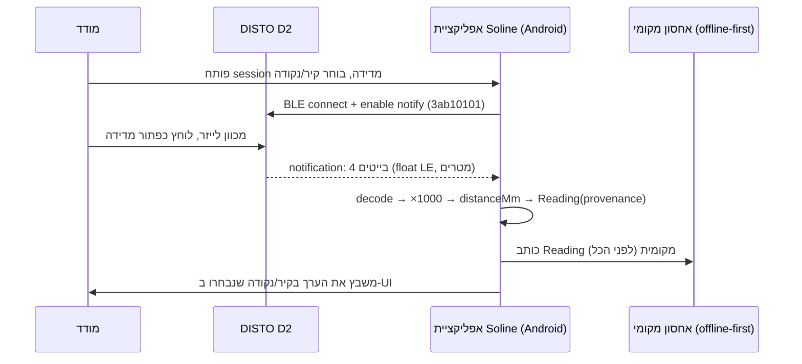

# אינטגרציית Leica DISTO ל-Soline

> מסמך מחקר — איך מחברים מד-מרחק לייזר Leica DISTO לאפליקציית אנדרואיד/טאבלט של Soline
> וקוראים ממנו מדידות ישירות בזמן-אמת.
> תאריך: 2026-08-14. מקורות ציבוריים (ראה §8). מה שלא היה נגיש מסומן במפורש.

---

## 0. תקציר מנהלים (TL;DR)

- **DISTO הוא חיישן הקלט של צינור-המדידה של Soline**: המודד לוחץ על ה-DISTO בשטח → המרחק
  נשלח דרך **Bluetooth Low Energy (BLE)** לטאבלט → נכנס למדידה (קיר/נקודה) → ORDX.
- **אין SDK רשמי ופומבי לנייד** מבית Leica לצד-שלישי. "DISTO Plugin" הרשמי הוא תוסף
  **CAD לדסקטופ** (AutoCAD/BricsCAD), ו"DISTO transfer" הוא כלי העברת-מקלדת ל-Windows — שניהם
  לא רלוונטיים לאפליקציית אנדרואיד. אפליקציית הצרכן הרשמית היא **DISTO Plan**.
- **המסלול המעשי היחיד לאינטגרציה טבעית באנדרואיד הוא BLE ישיר** מול ה-GATT של ההתקן.
  הפרוטוקול פוענח היטב בקהילה (ראה §2) — service UUID `3ab10100-…`, המרחק הוא **IEEE-754 float
  במטרים**. זה תואם בדיוק את חוזה `MeasurementDriver` שכבר מוגדר ב-Soline (מסמך 16).
- **המלצה:** BLE ישיר, לא SDK. שלושה צעדים ראשונים ב-§7.

---

## 1. סקירת מכשירים — משפחת DISTO

DISTO היא משפחת מדי-מרחק לייזר. הרלוונטיים ל-Soline הם הדגמים עם **Bluetooth Smart (BLE)**,
כי רק הם משדרים מדידה חיה לטאבלט. (דגמי בסיס ללא BLE, כמו D1/D110 ישן, אינם מתאימים לזרימה החיה.)

| דגם | טווח | דיוק | חיישן זווית/נטייה | חיבוריות | הערות ל-Soline |
|-----|------|------|-------------------|----------|-----------------|
| **D2** | 0.05–100 מ' | ±1.5 מ"מ | אין | **BLE 4.0** (Bluetooth Smart) | ה"סוס העבודה" הזול. מרחק בלבד — מתאים ל-`distance.point-to-point`. IP54. סוללות 2×AAA. זיכרון 10 ערכים. |
| **D110 / D1** | ~60 מ' | ±2.0 מ"מ | אין | BLE (D110); D1 בסיסי | דומה ל-D2 ברמת הפרוטוקול; טווח קצר יותר. |
| **X3** | 0.05–150 מ' | ±1.0 מ"מ | יש (±0.2°) | **BLE Smart** + ממשק נתוני נקודות 3D | עמיד (IP65), נופל מ-2 מ'. יש הטיה → מאפשר גם `angle`. תואם אביזר DST 360 לנקודות 3D. |
| **X4** | 0.05–150 מ' | ±1.0 מ"מ | יש | BLE Smart + Pointfinder (מצלמה/זום) | כמו X3 + מצלמת כיוון לחוץ/שמש. |
| **D510 / E7500i** | 0.05–200 מ' | ±1.0 מ"מ | יש (±0.3°) | BLE Smart + מצלמה | דגם חוץ ותיק, תואם היטב לאפליקציות. |
| **X6** | 0.05–150 מ' | ±1.0 מ"מ | יש | BLE Smart + Pointfinder | מוזכר במסמכי Soline (מסמך 16 §5.3) כמקור `point.3d`/`angle`/`area.derived`. |
| **BLK3D** | — | — | תמונות תלת-ממד + מדידה בתוך תמונה | BLE/WiFi + מסך | מכשיר "ריאליטי קאפצ'ר" — מעבר לצורך של v1. |

**מסקנה לדגם היעד של v1:** ה-**D2** הוא נקודת-הפתיחה הנכונה (זול, נפוץ, מרחק-בלבד — בדיוק
`distance.point-to-point` / trustClass 4 כפי שכבר מוגדר במסמך 16 §5.2). דגמי X (X3/X4/X6) מוסיפים
זווית ונקודות 3D לשלב מאוחר יותר, על אותו פרוטוקול-בסיס.

### 1.1 DISTO X6 — הדגם ל"מדידת-חדר מלאה" (העמקה)

ה-X6 הוא הדגם הגבוה במשפחת ה-DISTO ידני, ומעניין במיוחד ל-Soline כי הוא יכול למדוד **חדר שלם
מנקודה אחת** — לא רק מרחק סקלרי. הוא הדגם שכבר מוזכר במסמך 16 §5.3 כמקור `point.3d`/`angle`/`area.derived`.

**מפרט X6:**
| מאפיין | ערך |
|--------|------|
| טווח | 0.05–**250 מ'** (בתנאים טובים; 150 מ' בתנאים קשים) |
| דיוק מרחק | **±1.0 מ"מ** (טוב) / ±2.0 מ"מ (קשה) |
| חיישן נטייה (Tilt) | **360°**, סבילות **±0.2°** — מדידת גובה עקיפה, מפלסים |
| Pointfinder | מצלמה דיגיטלית עם **זום ×4** (כיוון מדויק לחוץ/שמש) |
| מסך | מסך מגע IPS **2.8"** — הפעלה חכמה על-גבי-ההתקן |
| **חיבוריות** | **Bluetooth 5.0** (לא נמצא WiFi — התקשורת היא BLE בלבד; ה"WiFi" שייך רק ל-BLK3D, לא ל-X6) |
| זיכרון | 300 דוחות + **1,000 נקודות 3D** נלכדות |
| סוללה | Li-Ion נטענת, טעינת **USB-C** |
| עמידות | IP65, נפילה מ-2 מ' |

**במה X6 שונה מ-D2/X3/X4:**
- מול **D2** — הבדל מהותי: ל-D2 אין חיישן זווית ואין נקודות 3D (מרחק סקלרי בלבד). X6 מוסיף נטייה
  360° ונקודות תלת-ממד → מאפשר מדידה גאומטרית מלאה, לא רק "כמה ס"מ".
- מול **X3** — X6 טווח גדול יותר (250 מ' מול 150), מצלמת Pointfinder (ל-X3 אין), מסך-מגע גדול,
  ו-Bluetooth 5.0. הדיוק זהה (±1.0 מ"מ). שניהם תומכים ב-P2P דרך אביזר.
- מול **X4** — X6 קרוב ל-X4 (שניהם עם Pointfinder), אך X6 עם מסך-מגע גדול יותר, טווח גדול יותר,
  וארגונומיה/עמידות משופרת. שניהם משפחת ה-Pointfinder.

**P2P (Point-to-Point) — הלב של "מדידת-חדר מלאה":**
לבדו, ה-X6 (כמו כל DISTO ידני) מודד **מרחק לאורך קו-הלייזר** + זווית-נטייה משלו. כדי למדוד **מרחק
בין שתי נקודות שרירותיות** (P2P) — למשל רוחב חלון גבוה, גובה תקרה משופעת, או קיר לא-נגיש — נדרש
האביזר **Leica DST 360-X** (מתאם חצובה):
- ה-DST 360-X מכיל חיישני **זווית אופקית + נטייה רגישים**. ה-X6 מתחבר אליהם, משלב אותם עם מדידת
  הלייזר וזווית-הנטייה שלו עצמו, ו**פותר טריגונומטריה** → מרחק/גובה/הפרש בין כל שתי נקודות.
- **מנקודת-עמידה אחת** אפשר לצלם מספר נקודות P2P → למדוד מישורים מורכבים במרחב תלת-ממדי: שטח
  והיקף של משטחים אופקיים, אנכיים או משופעים (גגות, חזיתות, תוכניות-רצפה מורכבות). זו בדיוק
  היכולת של **מדידת חדר שלם → גאומטריה → ORDX/CAD**.
- **דיוק P2P:** ±5 מ"מ ל-5 מ', ±10 מ"מ ל-10 מ' (פחות מדויק ממדידת-לייזר ישירה של ±1 מ"מ, כי הוא
  נגזר טריגונומטרית — חשוב לשקלול trustClass).

> **מסקנה:** X6 (בעיקר עם DST 360-X) הוא הדגם שמאפשר לקצר את הזרימה מ"מודד רץ עם סרט + לייזר על
> כל קיר" ל"מנקודה אחת סורקים את החדר → תוכנית-רצפה". זהו יעד ה**גרסה המתקדמת** של Soline (ראה §6).

---

## 2. פרוטוקול BLE — איך DISTO משדר מדידה

זהו החלק הקריטי. הפרוטוקול **אינו רשמי-פומבי** אך פוענח היטב על-ידי הקהילה (d2relay, B4X,
CaveSurvey ועוד — §8). כל ה-DISTO חולקים אותו **Vendor Service** אחד:

### 2.1 השירות והמאפיינים (GATT)

**Service UUID (ה"שירות של DISTO"):**
```
3ab10100-f831-4395-b29d-570977d5bf94
```

**Characteristics עיקריים** (הסיומת `-f831-4395-b29d-570977d5bf94` זהה לכולם; משתנה רק 8 הספרות הראשונות):

| Characteristic UUID (prefix) | תפקיד | פורמט | פעולה |
|------------------------------|-------|-------|-------|
| `3ab10101-…` | **מרחק (Distance)** | 4 בייטים, **IEEE-754 float**, **Little-Endian**, ערך ב**מטרים** | **Read + Notify/Indicate** |
| `3ab10102-…` | **יחידות** של המדידה (m/ft/in…) | קוד קצר (טרם פוענח מלא) | Read/Notify — *מתעדכן כשמופיעה מדידה חדשה בצג*, ומשמש כטריגר לקרוא את המרחק |
| `3ab10103-…` | **נטייה/זווית (Inclination)** — בדגמי X | float (מעלות) | Read/Notify |
| `3ab10104-…` | יחידות זווית | קוד | Read |
| `3ab10109-…` | ניתן-לכתיבה (**trigger** — הפעלת מדידה מרחוק) | פקודה | Write |
| `3ab1010a-…` | לא-ידוע (state/config) | — | — |
| `3ab1010c-…` | מזהה דגם ההתקן | מחרוזת | Read |
| `3ab1010d-…` | `BASIC_MEASUREMENT` (בדגמי X3 — מערך מדידה) | 4 בייטים ראשונים → float, Little-Endian, מטרים | Notify |

**שירותי BLE סטנדרטיים** שההתקן חושף בנוסף (שימושיים ל-`DeviceHealth` של Soline):
- Battery Service `0000180f-…` / Battery Level `00002a19-…` → **סוללה** (מסמך 16 `DeviceHealth.battery`).
- Device Information Service `0000180a-…` → firmware/יצרן/דגם (למילוי `DeviceDescriptor.firmware`).

### 2.2 זרימת קריאה (העיקרון המרכזי)

הפרוטוקול הוא **event-driven על בסיס notify**, לא polling:

```
1. Scan BLE → סינון לפי שם ("DISTO …") או לפי פרסום ה-service 3ab10100.
2. Connect (GATT) + (אם נדרש) Pair/Bond.
3. Discover services → אתר את 3ab10100 ואת ה-characteristics שלו.
4. Enable notifications: כתוב 0x0001 ל-CCCD (descriptor 2902) של מאפיין המרחק (3ab10101)
   ושל היחידות (3ab10102). ב-X3 גם על 3ab1010d.
5. המודד לוחץ על כפתור המדידה ב-DISTO (או שולחים trigger ב-3ab10109).
6. ההתקן שולח notification → קוראים 4 בייטים → float LE → מרחק במטרים.
   (במקביל 3ab10102 מתעדכן ומאשר שהמדידה טרייה.)
7. ממירים למ"מ (×1000) → יוצרים Reading → כותבים לאחסון המקומי (offline-first).
```

### 2.3 X6 / דגמי-X — זווית ונקודות 3D דרך אותו service

חשוב: **X6 (וכל דגמי-X) חולק את אותו service `3ab10100`** של D2 — אין service נפרד. ההבדל הוא
ש-X6 חושף characteristics **נוספים** מעבר למרחק:

| Characteristic | ב-X6 | מצב פענוח קהילתי |
|----------------|------|------------------|
| `3ab10101-…` מרחק | ✅ float LE, מטרים | **מאומת** (זהה ל-D2) |
| `3ab10103-…` **נטייה/זווית** | ✅ float, מעלות | מזוהה בקוד-הפתוח; פורמט float כמו המרחק. **טעון אימות מול X6 אמיתי.** |
| `3ab1010d-…` `BASIC_MEASUREMENT` | ✅ מערך בייטים | ב-X3 נצפה: 4 בייטים ראשונים → float LE (מרחק). מבנה המערך המלא (זווית/מרכיבי 3D) **לא פוענח מלא**. |

**אזהרה קריטית לגבי נקודות 3D דרך BLE ישיר:**
- **מרחק + זווית-נטייה** ניתנים לקריאה ישירה מה-BLE (3ab10101 + 3ab10103) — זה מספיק כדי לחשב
  בעצמנו height/clearance ונקודת-2D במישור הלייזר.
- **נקודת 3D מלאה (x,y,z) ו-P2P** דורשים את הזווית **האופקית** מה-DST 360-X. **לא ברור מהקוד
  הפתוח** אם ה-X6 משדר את נתוני ה-DST 360-X / קואורדינטת ה-3D המחושבת דרך ה-service הפומבי
  `3ab10100`, או שהחישוב קורה בקושחה/באפליקציית DISTO Plan בלבד. **זו שאלה פתוחה שחייבת אימות
  אמפירי מול X6 + DST 360-X** (ראה §7 צעד 1, ו-§8 "לא נגיש").
- כלומר: קריאת **מרחק + זווית** מ-X6 דרך BLE — סיכון נמוך (אותו דפוס כמו D2). קריאת **נקודת-3D/
  P2P מוכנה** דרך BLE — סיכון בינוני-גבוה, ייתכן שתדרוש הנדסה-לאחור נוספת או שאין אליה גישה
  פומבית.

**דקויות מהשטח (מתועדות בקהילה):**
- לפעמים subscribe למרחק לבדו "לא מודיע" — צריך להירשם גם על מאפיין היחידות/מצב, ולעיתים על
  **כל** ה-characteristics, כדי שה-notify יזרום. יש לבדוק אמפירית מול הדגם הספציפי.
- קידוד היחידות (3ab10102) לא פוענח לגמרי בקוד-הפתוח. **המלצה:** לנעול את ה-DISTO ליחידת **מטר**
  בהגדרות המכשיר, ואז המרה קשיחה m→mm בקוד — עוקף את חוסר-הוודאות ביחידות.
- **Bonding/Pairing:** חלק מהדגמים דורשים bonding של OS; חלק מתחברים ישירות. יש לתכנן זרימת
  צימוד ב-UI (ראה §4).

---

## 3. אפשרויות אינטגרציה למפתחים

| מסלול | מה זה | זמינות לנייד | ורדיקט ל-Soline |
|-------|-------|--------------|------------------|
| **BLE ישיר** (קריאת ה-GATT) | קוד שלנו מדבר ישירות עם ה-service 3ab10100 דרך Android BLE API | ✅ מלא | **המסלול הנבחר.** שליטה מלאה, offline, ללא רישוי/תלות-ספק. |
| **Leica DISTO Plugin** | תוסף **CAD לדסקטופ** (AutoCAD 2017+/BricsCAD V22+, פקודה `leicadisto3d`) | ❌ דסקטופ בלבד | לא רלוונטי לאנדרואיד. |
| **DISTO transfer (PC)** | מזרים מדידה כ"הקשת מקלדת" לחלון Windows פעיל (Excel/Word/Revit) | ❌ Windows בלבד | לא רלוונטי לנייד; זו ככל-הנראה השיטה מאחורי הזרימה הנוכחית דרך InnoDraw (§5). |
| **DISTO Plan (app רשמי)** | אפליקציית הצרכן של Leica (iOS/Android) | סגור — לא SDK | לא ניתן להטמיע; שימושי רק כאב-טיפוס ידני/בדיקת המכשיר. |
| **SDK רשמי לנייד** | — | **לא קיים באופן פומבי** | אין נתיב זה. אם צריך "רשמי", יש לפנות ל-Leica לרישיון/שותפות — לא נמצא תיעוד ציבורי. |

**מסקנה:** אין SDK-נייד רשמי לצד-שלישי. אין ברירה מעשית אחרת מ**BLE ישיר**. זה גם *מיטיב* עם
Soline — הארכיטקטורה ההקסגונלית (מסמך 03/16) כבר מניחה שהדרייבר מדבר BLE ישירות והדומיין לא מייבא
SDK של יצרן. אין "vendor lock" ואין תלות ברישוי.

---

## 4. תוכנית אינטגרציה ל-Soline (דרייבר D2 על אנדרואיד)

הדרייבר מממש את הפורט `MeasurementDriver`/`DriverSession` (מסמך 16 §1) — **בלי לשנות את הליבה**.
מיפוי מלא לחוזה הקיים:

### 4.1 מיפוי לחוזה `MeasurementDriver`

```
descriptor():  { vendor:'Leica', model:'D2', transport:'ble',
                 capabilities:[{ capability:'distance.point-to-point',
                   accuracy:{absoluteMm:1.5}, range:{minMm:50,maxMm:100000},
                   acquisition:'one-shot', trustClass:4 }] }   // ← כבר מוגדר במסמך 16 §5.2

connect():     BLE scan → connect → (bond) → discover 3ab10100 → enable notify
               על 3ab10101 (+3ab10102). מחזיר DriverSession.

capture(req):  ממתין ל-notification הבא (לחיצת המשתמש על ה-DISTO) → קורא 4 בייטים →
               float LE → ×1000 → distanceMm. עוטף ב-Reading עם provenance מלא.

health():      קורא Battery Level (00002a19) → battery; RSSI → bleSignal;
               ready=חיבור פעיל; lastError מ-'out-of-range'/'weak-target'/'timeout'.

close():       מנתק GATT.
```

**payload** (תואם מסמך 16 §5.2): `{ distanceMm:number, signalQuality?:number }`.
כל `Reading` נושא `calibrationId`, `frameRef`, `operatorId`, `capturedAtTs` — שרשרת המקור.

### 4.2 זרימת "לחיצה על DISTO → מדידה נכנסת לאפליקציה"



**שיבוץ המדידה:** ה-UI מחזיק "מוקד קלט" פעיל (איזה קיר/נקודה מחכה לערך). ה-notification הבא
נכנס לשם אוטומטית — המודד לא נוגע בטאבלט בזמן שהוא מכוון את הלייזר. אפשר "auto-advance" למוקד הבא.

### 4.3 אילוצי offline (מסמך 16 §7)

- **צימוד ולכידה בטאבלט**, לא בשרת. הדרייבר רץ בסביבת הלקוח (Android).
- כל `Reading` נכתב לאחסון המקומי **לפני** כל דבר אחר (עמידות > קישוריות).
- **חיבור מחדש:** ניתוק BLE באמצע session לא מאבד קריאות שכבר נלכדו; ה-session מתחבר מחדש
  וממשיך (מסמך 16 DV-6).
- **בריאות ל-UI:** סוללת DISTO + עוצמת BLE מוצגות כדי שמפעיל לא ייתקע.

### 4.4 מלכודות טכניות לתכנון מראש

1. **הרשאות אנדרואיד:** BLE מודרני דורש `BLUETOOTH_SCAN`/`BLUETOOTH_CONNECT` (API 31+), ולעיתים
   Location להרשאת scan בדגמים ישנים. לתכנן onboarding הרשאות.
2. **notify שלא זורם:** לפעמים חובה subscribe גם ליחידות/מצב (ראה §2.2). לבדוק מול D2 אמיתי.
3. **יחידות:** לנעול את ה-DISTO ל-m; המרה קשיחה בקוד. לא לסמוך על פענוח 3ab10102 עד שיאומת.
4. **ניהול חיבור:** לשמור על חיבור GATT יציב לאורך session; לטפל ב-reconnect אוטומטי.
5. **מסגרת-קואורדינטות:** ה-D2 נותן **מרחק סקלרי בלבד** (לא נקודת 3D). ה-`frameRef` ושיוך
   הערך לקיר/מקטע מסוים הם באחריות ה-UI/הדומיין, לא ההתקן.

---

## 5. התאמה לזרימה הקיימת (InnoDraw El_Cad → ORDX)

**המצב היום (כפי שמתואר במשימה):** מדידה עוברת דרך InnoDraw El_Cad → הלייזר Leica DISTO מוזן
לתוכנה → ORDX. סביר מאוד שהחיבור הנוכחי הוא **DISTO transfer בסגנון "הקשת מקלדת" ל-Windows**
(§3) או ייבוא ידני — שולחני, תלוי-Windows, ולא offline-נייד.

**מה BLE ישיר מקצר/מחליף:**
- מסיר את התלות ב-InnoDraw/El_Cad וב-Windows כמתווך העברת-הנתונים. הטאבלט קורא ישירות מה-DISTO.
- הופך את הזרימה ל**נטולת-דסקטופ ו-offline-first**: DISTO → אפליקציית Soline (אנדרואיד) → מדידה
  מובנית → ORDX, ישירות בשטח.
- שומר על שרשרת-מקור (provenance) מלאה לכל קריאה — דבר שהעברת "הקשת מקלדת" לא נותנת (אין
  calibrationId/operatorId/timestamp אמין).
- מיישר קו עם הארכיטקטורה של Measurement Engine: ה-D2 הופך ל-adapter של `MeasurementDriver`,
  והמדידה זורמת לצינור האחיד יחד עם קלט ידני ו-X6, כולל אימות-צולב (מסמך 16 §4).

**מה כדאי לשמר בינתיים:** אם ORDX עדיין נדרש כפורמט יעד, הזרימה החדשה מייצרת את אותם ערכי-מרחק
ומזינה אותם למחולל ה-ORDX/CAD של Soline — פשוט מדלגת על שלב InnoDraw כמתווך-הקלט.

---

## 6. סיכום — SDK מול BLE ישיר

| קריטריון | SDK רשמי | **BLE ישיר** |
|----------|----------|--------------|
| זמינות לנייד/אנדרואיד | ❌ לא קיים פומבי | ✅ |
| offline-first | — | ✅ מלא |
| רישוי/תלות-ספק | דורש פנייה ל-Leica, לא מתועד | ✅ אין |
| התאמה לארכיטקטורת Soline | — | ✅ תואם `MeasurementDriver` ישירות |
| בשלות הפרוטוקול | — | ✅ פוענח היטב בקהילה (D2/X3) |
| סיכון | תלות חיצונית | פענוח יחידות + notify דורשים אימות אמפירי |

**המלצה חד-משמעית: BLE ישיר.** אין SDK-נייד רשמי, וגם אם היה — הארכיטקטורה של Soline מתוכננת
כך שהדרייבר מדבר BLE והדומיין נשאר נקי. הסיכון היחיד (פענוח יחידות/notify) קטן ומנוהל: לנעול
יחידות למטר ולאמת מול מכשיר אמיתי.

### 6.1 מפת-דרכים לפי דגם: D2 עכשיו, X6 לגרסה מתקדמת

| שלב | דגם | יכולת | מה זה נותן ל-Soline | סיכון BLE |
|-----|-----|-------|---------------------|-----------|
| **v1 (בסיס)** | **D2** | `distance.point-to-point` | מרחק חי לכל קיר/מקטע, offline. מחליף את מסלול InnoDraw. | נמוך — מאומת |
| v1.5 | X3/X4 | + `angle` | זווית-נטייה למדידת גובה עקיפה, מפלסים | נמוך — אותו דפוס |
| **v2 (מתקדם)** | **X6 (+ DST 360-X)** | `point.3d`, `area.derived`, P2P | **מדידת-חדר מלאה מנקודה אחת → תוכנית-רצפה → ORDX אוטומטי** | בינוני — נקודת-3D/P2P דרך BLE טעונה אימות |

**האם X6 הוא היעד לגרסה מתקדמת? כן — בהסתייגות אחת.** X6 הוא הדגם היחיד במשפחה שמאפשר את
החזון "המודד עומד במרכז החדר, סורק P2P, ו-ORDX נבנה אוטומטית" — במקום למדוד קיר-קיר עם D2. אבל:
- **מרחק + זווית** מ-X6 דרך BLE הישיר — בטוח, אותו דפוס כמו D2 (characteristics `3ab10101` + `3ab10103`).
- **נקודת-3D/P2P מוכנה** דרך BLE הישיר — **טעון הוכחת-היתכנות** מול X6 + DST 360-X אמיתיים לפני
  התחייבות (ראה §2.3). אם מסתבר שה-P2P מחושב רק בקושחה/ב-DISTO Plan ולא נחשף ב-`3ab10100`, שתי
  חלופות: (א) לקרוא מרחק+זווית גולמיים ולחשב את הטריגונומטריה בעצמנו ב-Soline; (ב) לבחון אם Leica
  חושפת ערוץ P2P כלשהו (טעון בירור מול היצרן — לא תועד פומבית).

**לכן:** להתחיל v1 עם D2 (ודאי), ולהריץ **הוכחת-היתכנות נפרדת ל-X6 P2P** לפני שמתכננים את גרסת
מדידת-החדר סביבה.

---

## 7. שלושה צעדים ראשונים

1. **לרכוש D2 ולמפות אותו אמפירית.** להתחבר עם כלי BLE (nRF Connect / d2relay) ולאמת מול המכשיר
   שברשותנו: לוודא `3ab10101` = float LE במטרים, לבדוק אילו characteristics חייבים subscribe כדי
   שה-notify יזרום, ולפענח את קוד היחידות ב-`3ab10102` (או לנעול ל-m). לתעד את המפה המאומתת.
2. **לבנות PoC דרייבר D2 באנדרואיד** מול הפורט `MeasurementDriver` (מסמך 16 §5.2): scan→connect→
   notify→decode→`Reading` עם provenance, כתיבה לאחסון מקומי. יעד: "לחיצה על DISTO → מספר מופיע
   באפליקציה offline" (תרחיש DV-1).
3. **לשלב ב-UI השטח את זרימת "מוקד קלט → שיבוץ במדידה"**: בחירת קיר/נקודה, קליטת הערך אוטומטית,
   auto-advance, והצגת בריאות (סוללה/BLE). לאחר מכן להרחיב ל-X3/X6 (זווית + נקודות 3D) על אותו
   פרוטוקול-בסיס, ולחבר לצינור ה-ORDX/CAD במקום מסלול InnoDraw.

---

## 8. מקורות ומה שלא היה נגיש

**נגיש (מקורות ציבוריים):**
- פרוטוקול D2 מפוענח — `seichter/d2relay` (doc/notes.md): טבלת ה-characteristics ופורמט ה-float.
- דיון קהילתי B4X: "BLE2 = Leica Disto and Bosch laser rangefinder" — service UUID, subscribe, notify.
- gist (AppWerft) + `normanargiolas/disto-leica-bluetooth` + `JEK58/Disto-for-Mac` + `d7knight/Disto-App`
  — אישוש ה-service `3ab10100` ושמות ההתקנים.
- CaveSurvey wiki (D110) — אישוש דרישת BLE.
- מפרטי דגמים: shop.leica-geosystems.com (D2, X3, **X6** — data-sheet 2405 V1.12), laserinst.com (X3),
  sccssurvey/engineersupply/aaisurvey (X6), מדריך "DISTO Bluetooth Smart usage on Android".
- טכנולוגיית **P2P** ו-**DST 360-X**: shop.leica-geosystems.com "Point to Point Technology" +
  X6 P2P-Package + X6 FAQs.
- מסמכי Soline פנימיים: `docs/03-Device-Plugin-Architecture.md`, `docs/16-Device-Driver-Contract-Spec.md`
  (חוזה `MeasurementDriver`, דרייבר D2/X6, offline-first).

**לא היה נגיש:**
- **פורטל Leica myWorld** — נוסו **שני** נתיבים ושניהם חסומים: `…/s/downloads?p=WWPC+DISTOD2`
  ו-`…/s/en-US/knowledge-articles`. שניהם SPA מבוסס-JavaScript; WebFetch מחזיר רק כותרת ריקה
  ("myWorld @ Leica Geosystems") ללא רשימת מאמרים/מסמכים. לא נמשך מהם knowledge-article על BLE/פרוטוקול/SDK/X6.
- **קובצי datasheet PDF** של itm.com/globaltestsupply — הורדו אך הגיעו כבינארי לא-קריא; המפרטים
  לוקטו ממקורות HTML חלופיים במקום.
- **פענוח מלא של קוד היחידות** (`3ab10102`) — לא הושלם בקוד-הפתוח; דורש אימות מול מכשיר (צעד 1).
- **פענוח נקודת-3D/P2P של X6 דרך BLE** — לא תועד בקוד-הפתוח. זווית (`3ab10103`) מזוהה אך לא
  מאומתת מול X6; קואורדינטת ה-3D המלאה / נתוני DST 360-X — לא ידוע אם נחשפים ב-service הפומבי.
  **דורש אימות אמפירי מול X6 + DST 360-X** (§2.3, §6.1).
- **תיעוד SDK-נייד רשמי של Leica** — לא נמצא באופן פומבי; ככל הידוע לא קיים לצד-שלישי.
