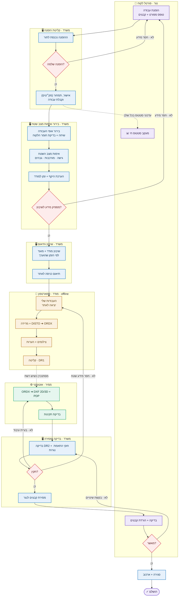

# תרשים זרימה — תהליך העבודה מקצה לקצה

מקור־האמת של **התהליך התפעולי**. האפליקציה נבנית מול התרשים הזה. כל שלב ממופה ל-`job.stage`.

## התובנה המרכזית: זו פלטפורמת שירות רב־נגרים
התהליך **לא מתחיל במשרד** — הוא מתחיל אצל ה**נגר**. הנגר הוא הלקוח של Soline:
הוא פותח הזמנת עבודה, עוקב אחרי הסטטוס לאורך הדרך, ומקבל את הקבצים הסופיים בסוף.
Soline מבצעת את המדידה + ההמרה + התכנון, ומחזירה לנגר את הפרויקט.

```
נגר (מזמין) ─▶ Soline (מודד → ממיר → בודק) ─▶ נגר (מקבל קבצים)
```

## ארבעה תפקידים
| תפקיד | מי | מכשיר | מה רואה |
|---|---|---|---|
| **נגר** | הלקוח (חיצוני) | מחשב/טלפון (web) | רק ההזמנות שלו — יצירה, מעקב סטטוס, הורדת קבצים |
| **מודד** | צוות שטח | סמארטפון (APK, offline) | רק העבודות שהוקצו לו — קליטת מדידה |
| **מתאם** | תפעול Soline | מחשב | כל העבודות — קליטה, שיבוץ, בדיקה, מסירה |
| **מנהל** | Michael (בעלים) | מחשב | הכול + ניהול משתמשים, הרשאות, דוחות |

> אותו קוד לכל המכשירים. ההבדל = **תצוגה והרשאות לפי תפקיד**. פירוט ב-`ROLES_PERMISSIONS.md`.

## התרשים


## השלבים ומיפוי ל-job.stage
| # | שלב | תפקיד · מכשיר | job.stage (פנימי) | הנגר רואה |
|---|---|---|---|---|
| N1 | הזמנת עבודה (טופס) | נגר · web | `submitted` | נשלחה — ממתינה לאישור |
| O1–O3 | קליטה + תמחור (מק״טים) + אישור | מתאם · מחשב | `accepted` | התקבלה + הצעת מחיר |
| V1–V4 | בירור ואימות מצב שטח + הערכת זמן | מתאם · מחשב | `assessment` | בבירור פרטים |
| O4–O5 | שיבוץ + תיאום כניסה | מתאם · מחשב | `scheduled` | בתיאום מועד |
| F1–F3 | יציאה + מדידה בשטח | מודד · טלפון | `in_field` | במדידה |
| F4 | קליטת ORDX + הערות | מודד · טלפון | `measured` (DR1) | במדידה |
| P1–P2 | המרה + בדיקת תקינות | ממיר · אוטומטי | `processing` | בעיבוד |
| Q1–Q2 | בדיקה DR2 + התאמת נגרות | מתאם · מחשב | `review` (DR2) | בבדיקה |
| D1 | מסירת קבצים לנגר | מתאם · מחשב | `delivered` | מוכן — נא לאשר ולהוריד |
| N8–N9 | בדיקה + הורדה + אישור | נגר · web | `approved` | הושלם |
| E1 | סגירה + ארכוב | מתאם · מחשב | `closed` | הושלם |

## לולאות תיקון
- **הזמנה חסרה** (O2→N1): ההזמנה לא שלמה → בקשת הבהרה חוזרת לנגר.
- **בירור לא מספק** (V4→N1): מצב השטח לא ברור דיו לשיבוץ → בקשת מידע נוסף מהנגר/לקוח.
- **בעיית עיבוד** (Q2→P1): תכנית שגויה בגלל המרה → מריצים שוב את הממיר.
- **חסר מידע שטח** (Q2→F1): חסרה מדידה → העבודה חוזרת לטלפון של המודד.
- **בקשת שינויים מהנגר** (N9→Q1): הנגר ביקש תיקון → חוזרים לבדיקה/עדכון.

זרימת **DR1 → DR2 → חתום** מ-`../ordx-pdp-converter/docs/field_reconciliation.md`:
`measured` (DR1) → `review` (DR2) → `approved` (חתום ע״י הנגר).

## תמחור ומק״טים
כל התמחור מנוהל בתוכנה דרך **קטלוג מק״טים** (שירות = מק״ט + מחיר), עם מחירון מיוחד לכל נגר.
ההזמנה נבנית משורות מק״ט → הצעת מחיר → אישור הנגר. ה**מחיר** גלוי לנגר ולמשרד;
ה**רווחיות** (מחיר − עלות מהמנוע) — רק לאדמין. פירוט מלא: `docs/PRICING_CATALOG.md`.

## מנוע מדדים נסתר
מתחת לכל התהליך רצה שכבה שאוספת אוטומטית **זמן עבודת משרד · זמן נסיעת מודד · זמן מדידה · ק״מ נסיעה**,
לחישוב עלות ורווחיות אמיתית לכל עבודה, ולשיפור הערכת הזמן בשלב הבירור.
**נסתר לחלוטין — רק האדמין הראשי (מנהל) רואה.** פירוט מלא: `docs/METRICS_ENGINE.md`.
